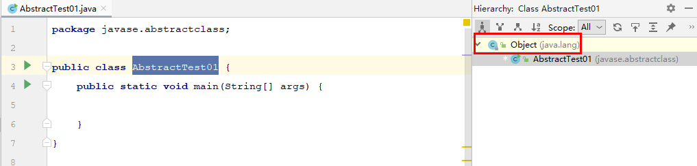
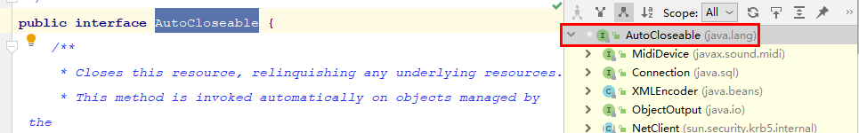

# java - demo

## 项目起源

- Java 知识点总结。
- 钻研 JDK 源码，分析内在逻辑和**设计模式**。

# javase

## 语言基础
### 分支语句

#### while & for 循环：开发使用 for 循环比较多，变量可以从内存中较早的消失？

[可以](src/javase/branch/LoopTest01.java)

```java
public class LoopTest01 {
    /*
    实验：for 和 while 循环
    验证：for 循环，变量可以从内存中较早的消失
    结果：循环结束时，i 变量仍存在，j 变量已消失，验证结论
    */
    public static void main(String[] args) {
        int i = 3;
        while (i > 0) {
            System.out.println(i--);
        }

        for (int j = 0; j < 3; j++) {
            System.out.println(j);
        }
    }
}
```


## 面向对象

### 抽象类

#### 抽象类能够继承非抽象类？

Object 类是 sun 公司提供的根类，所有类都默认是继承 Object 类，其中就有抽象类，所以答案是[可以](src/javase/abstractclass/AbstractTest01.java)。举个例子：




无论是 java 自带的类库还是自己新建的抽象类，无一例外继承了 Object 类。

### 接口

#### 接口的根类是 Object 类？

不是，[这篇文章](https://blog.csdn.net/xidiancoder/article/details/78011148)很详细说明了。举个例子：



## 异常

# JDK 源码 - 看虚拟机规范和基础学习

## JVM 8 虚拟机规范 2.12 Class Libraries

Java SE platform 运行一些类库需要虚拟机的支持，如

- java.lang.reflect 包和类 Class：reflect 包提供了 .class 文件反射成 .java 文件的一些类，如 Method，Field，Modifier 等。
- Loading 加载或者 creation 产生一个接口或类，最经典的例子就是 ClassLoader 类。
- Linking 连接和 initialization 初始化一个类或接口。上面的一些类也是属于这个范畴。
- Security，java.security 包和其他类如 SecurityManager。
- 多线程，Thread 类。
- Weak references，java.lang.ref 包，API 中只显示 5 个类，比包内少了  3 个。


# **下面是需要整合的内容**

# Calendar 的使用
- Calendar 类使用了简单工厂模式(静态工厂模式)，使用此方法获得唯一的实例对象
- 通过追寻源码可知，getInstance 方法中调用的是 createCalendar 方法，createCalendar 方法的参数分别是获取时区 TimeZone.getDefault() 和地区 Locale.getDefault(Locale.Category.FORMAT)，Locale 获取的默认方法中使用了双重检查的方法来确保线程安全
```
case DISPLAY:
            if (defaultDisplayLocale == null) {
                synchronized(Locale.class) {
                    if (defaultDisplayLocale == null) {
                        defaultDisplayLocale = initDefault(category);
                    }
                }
            }
            return defaultDisplayLocale;
```
```
private volatile static Locale defaultDisplayLocale = null;
```

- 通过追寻源码可以看到，这个变量 defaultDisplayLocale 使用了 volatile 关键字，再使用了双重检查的方式确保多线程调用的环境下有效的获取变量，提高效率。
# constructor 构造方法

- 默认构造方法的 super() 调用
- 父类 SuperClass 和 子类 SubClass，当子类的没有写构造方法的时候，编译会默认追加注释行代码
```java
public class SuperClass {
    public SuperClass() {
        System.out.println("Super");
    }
}
```
```java
public class SubClass extends SuperClass {
    //public SubClass() {
    //    super();
    //}
}
```
- 注释行代码写与否都会输出下列的结果 output: Super
```java
public class Test01 {
    public static void main(String[] args) {
        //测试证明，子类如果不重写，编译器也会默认写上 super() 这一行代码
        SubClass subClass = new SubClass();
    }
}
```

# modifier
这个实验是为了确定修饰符的作用范围。原先将四种修饰符：private,(default),protected,public。

| 修饰词    | 本类 | 同一个包的类 | 子类 | 任何地方 |
| --------- | ---- | ------------ | ---- | -------- |
| private   | √    | ×            | ×    | ×        |
| (default) | √    | √            | ×    | ×        |
| protected | √    | √            | √    | ×        |
| public    | √    | √            | √    | √        |

其中需要注意：子类一般是指在同一个包下的子类，如果子类不在同一个包，则此时的 protected 修饰的属性就不能访问了，因为 protected 的修饰符作用权限只在本包内。
[真实情况更为复杂](https://blog.csdn.net/asahinokawa/article/details/80777302)