# GitHub - 在 Windows 系统下使用批处理文件自动提交代码到 GitHub 上

## 需求

每天都上传代码到 GitHub 上，需要一种脚本文件自动完成一些重复的工作。

- git add .
- git commit -m "message"
- git push

缺点是上传的 message 都为 "auto commit"，违背了代码管理的初衷，以后查看这些 message 很难知道当时修改了什么内容。

经过测试可得，如果当天没有修改项目文件内容，则不会完成 add commit push 操作。因此也可以在需要记录的当天手动执行 commit，加上一些必要的 message 信息，批处理文件则会完成 push 操作。

此前准备，需要已经配置好手动完成 push 到远程仓库的操作，在这种条件下才能完成自动化脚本的正确运行。

## 实现

### 编写文件

- 先在 Windows 下创建一个 `leetcode.txt` 文件，并输入以下内容。完成后更改文件内容后缀名，使其变成 `leetcode.bat` 批处理文件。

```bash
@echo off
@title bat execute git auto commit
F:
cd F:/Code/Java/algorithm/leetcode
git add .
git commit -m "Auto commit."
git push
```

- 解释说明：再次强调，如果看了这些解释仍不清楚 bat 文件的作用则需要先手动 commit 到 GitHub 上。

```bash
@echo off #打开回显或关闭请求回显功能，off 可以改成 on。
@title bat execute git auto commit #运行时命令行窗口的 title
F:
cd F:/Code/Java/algorithm/leetcode #这里是要提交的项目目录，需要更改成自己的文件目录
git add .
git commit -m "Auto commit."
git push #git 命令
```

### 使用 Windows 的任务计划程序

- 创建基本任务

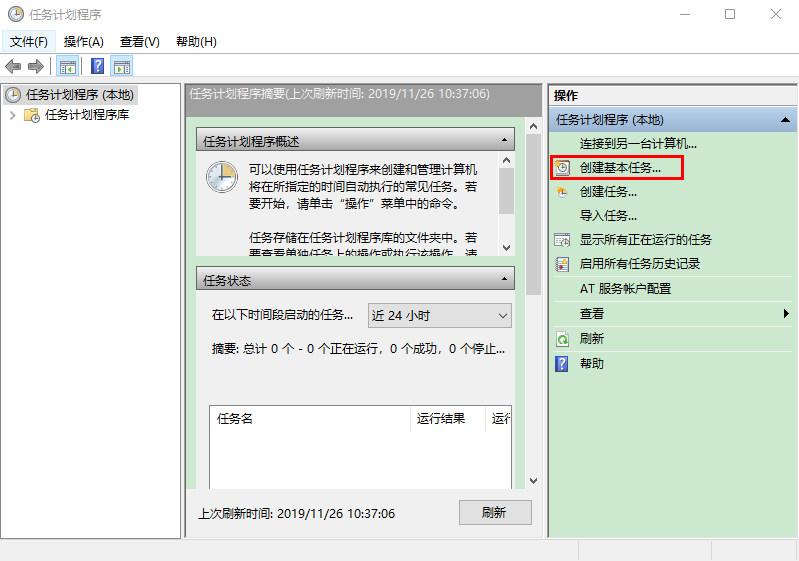

- 填写信息

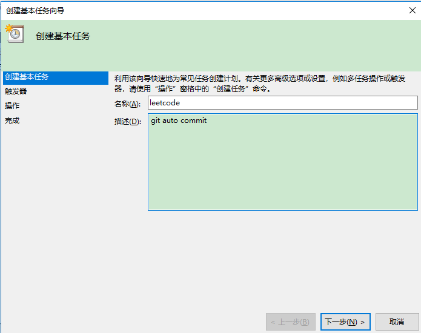

- 设置触发器为每天启动

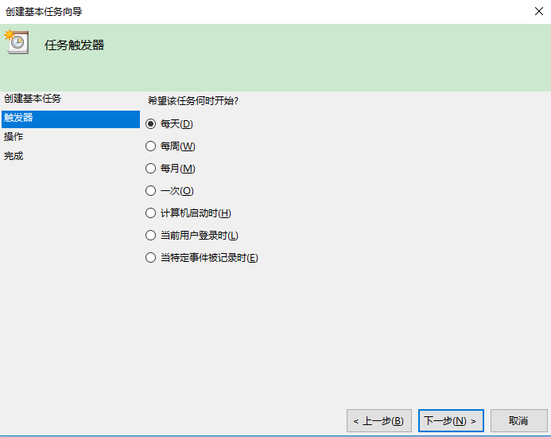

- 设置每天启动的时间

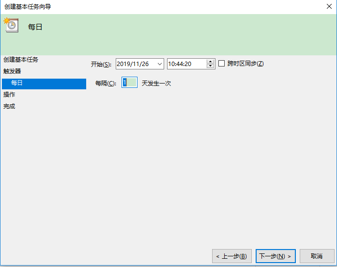

- 设置操作

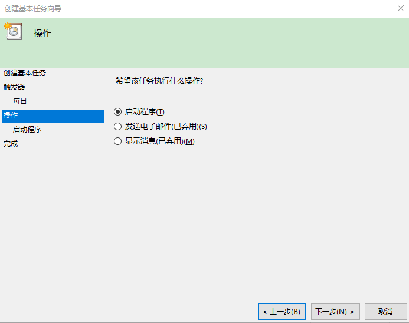

- 配置刚才写的脚本文件 `leetcode.bat` 

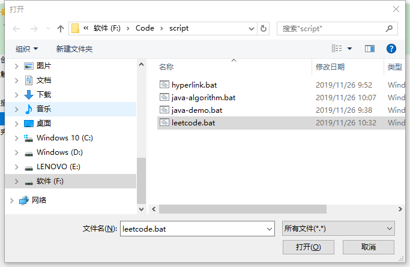

- 完成

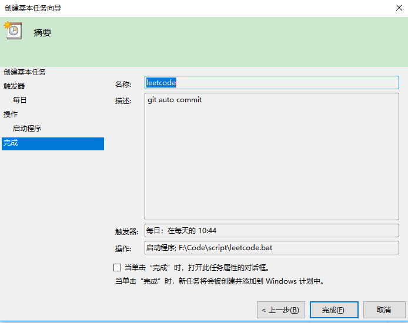

### 查看

- 可以在任务计划程序库查看是否成功添加

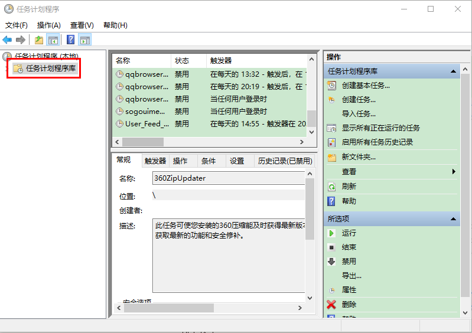

# GitHub - 如何高效搜索一个项目

## 网址

真传一句话，假传万卷书。网址给上，https://github.com/search/advanced。

通过 GitHub 做的图形化界面，可以很快的学会如何快速搜索，里面的选项非常全面，当用熟练之后也就自然而然掌握常用的几个搜索限制条件。

## 常用

| 提示            | 输入          |
| --------------- | ------------- |
| Advanced search | spring boot   |
| language        | language:Java |
| stars           | stars:>1000   |
| forks           | forks:>1000   |

stars 和 forks 数一定程度可以看到项目受欢迎的程度，`Search` 在底部也有，不用再跳到顶部。

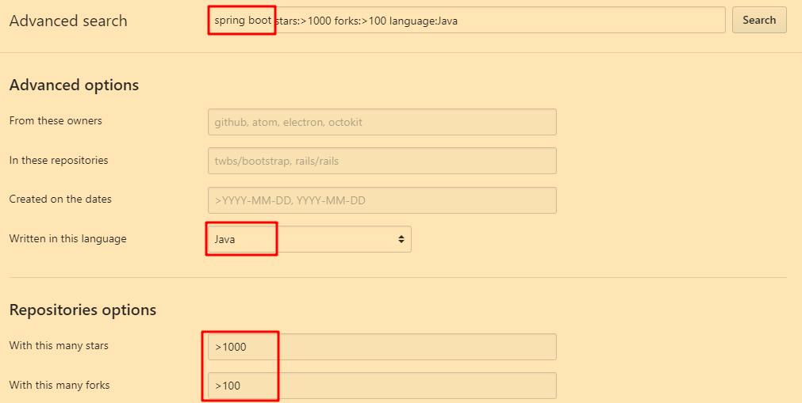

## 进阶

| 输入                    | 作用                                                      |
| ----------------------- | --------------------------------------------------------- |
| in:name springboot      | 在项目名出现 springboot                                   |
| in:description 管理系统 | 在项目描述中出现管理系统的项目，下面给出图片              |
| in:readme 微服务        | 在 README 文档中搜索有微服务字眼的项目                    |
| pushed:>2019-01-01      | 在 2019-01-01 后仍有更新的项目，注意日期的写法 YYYY-MM-DD |

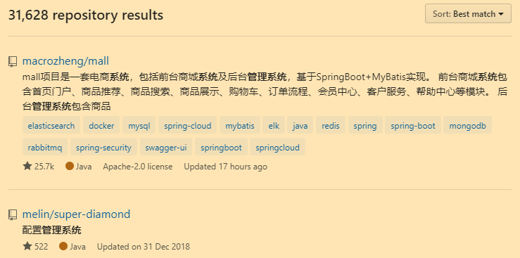


## 总结

学会在 GitHub 这个平台搜索项目能够满足自己做项目的需求，也可以在平台上学习如何修 bug，即使一开始自己不会修，也可以观摩其他大神是如何修 bug 的，看就自己总会有所收获。

# GitHub - 不常用的功能

## compare

`https://github.com/vuejs/vue/compare/dev...0.12-csp`

上面举了一个例子，是 vuejs 的 vue 项目，使用了 compare 功能来比较项目不同 commit 的区别，比较的双方是 `dev` 和 `0.12-csp` 。举这个例子来展示 GitHub 网站的 compare 功能。

## tree

`https://github.com/vuejs/vue/tree/dev`

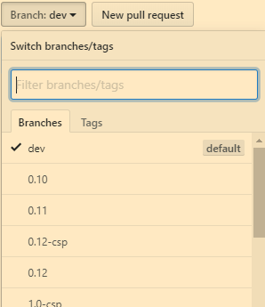

GitHub 网站将每一次 commit 都视为 tree 的一部分，可以在选项框选择某一个 commit 回退查看当时的代码。

# GitHub - 自动构建 GitHub 项目的 README.md 目录

本文适合支持 Markdown 语法的文本的自动化目录构建。

## 结果

目录自动生成，可自动化更新。

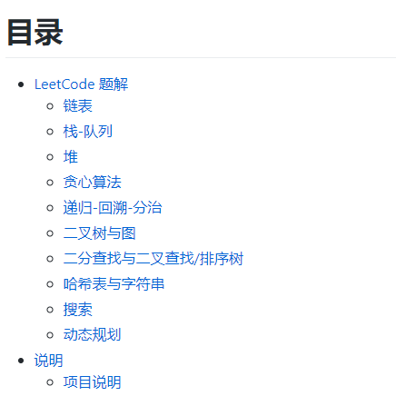

```markdown
# 目录

<!-- MarkdownTOC levels="1,2" autolink="true" -->

- [LeetCode 题解](#leetcode-%E9%A2%98%E8%A7%A3)
  - [链表](#%E9%93%BE%E8%A1%A8)
  - [栈-队列](#%E6%A0%88-%E9%98%9F%E5%88%97)
  - [堆](#%E5%A0%86)
  - [贪心算法](#%E8%B4%AA%E5%BF%83%E7%AE%97%E6%B3%95)
  - [递归-回溯-分治](#%E9%80%92%E5%BD%92-%E5%9B%9E%E6%BA%AF-%E5%88%86%E6%B2%BB)
  - [二叉树与图](#%E4%BA%8C%E5%8F%89%E6%A0%91%E4%B8%8E%E5%9B%BE)
  - [二分查找与二叉查找/排序树](#%E4%BA%8C%E5%88%86%E6%9F%A5%E6%89%BE%E4%B8%8E%E4%BA%8C%E5%8F%89%E6%9F%A5%E6%89%BE%E6%8E%92%E5%BA%8F%E6%A0%91)
  - [哈希表与字符串](#%E5%93%88%E5%B8%8C%E8%A1%A8%E4%B8%8E%E5%AD%97%E7%AC%A6%E4%B8%B2)
  - [搜索](#%E6%90%9C%E7%B4%A2)
  - [动态规划](#%E5%8A%A8%E6%80%81%E8%A7%84%E5%88%92)
- [说明](#%E8%AF%B4%E6%98%8E)
  - [项目说明](#%E9%A1%B9%E7%9B%AE%E8%AF%B4%E6%98%8E)

<!-- /MarkdownTOC -->
```

## 过程

### 准备工具

Sublime Text3

插件 MarkdownTOC：[https://github.com/naokazuterada/MarkdownTOC](https://github.com/naokazuterada/MarkdownTOC)

### 方法

如何给 Sublime Text3 安装插件？参看博客或搜索一下，给出一篇参考的博客：https://blog.csdn.net/wxl1555/article/details/69941451/
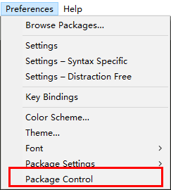

安装了 Package Control 后，使用 Ctrl + Shift + P，查找 MarkdownTOC，然后安装。

题外话：由于本人先下载 GitHub 的项目到本地，然后使用 Sublime Text3 安装的 MarkdownTOC，因此并不是很清楚它的安装机制。不过想要复现操作的话最好还是按照相同的步骤，出错率低一些。

### 使用

参考 MarkdownTOC 使用说明书：[https://github.com/naokazuterada/MarkdownTOC/blob/master/images/capture.gif](https://github.com/naokazuterada/MarkdownTOC/blob/master/images/capture.gif)

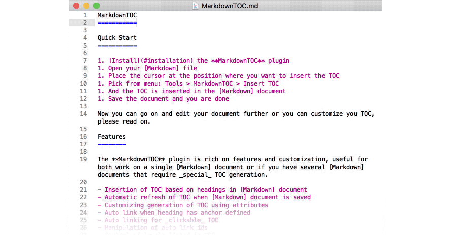

打开一篇 Markdown 语法写的文章，将光标放到**需要做成目录的标题前**，按照提示的 gif 图操作即可。

## 总结

此前一直想找寻这种类型的工具，但是苦求不得，终于如愿以偿了。

中文的编码处理一般较难，如下面的 **栈-队列** 就是从 **栈、队列** 中改变过来，因此建议在标题项中将一些中文标点符号改成 `-` 表示。

题外话：下面的编码是用的 **URL 编码**，感兴趣可以搜一下。这个站点可以测试编码和解码：http://tool.chinaz.com/tools/urlencode.aspx 

```markdown
[栈-队列](#%E6%A0%88-%E9%98%9F%E5%88%97)
```


# GitHub - 如何学习一个项目

如果已经在 GitHub 上找到了一个完整的项目，如何学习一个项目呢？以 [halo](https://github.com/halo-dev/halo) 博客系统为例，该项目使用 gradle 管理，使用了 Spring Boot 框架。

## 查看依赖

通过 maven 或 gradle 的配置查看项目依赖了哪些组件。

## 运行项目

Spring Boot 的项目在 src 目录下有一个 application 入口，可以据此运行整个项目。

查看 resources，配置文件等非代码的文件。

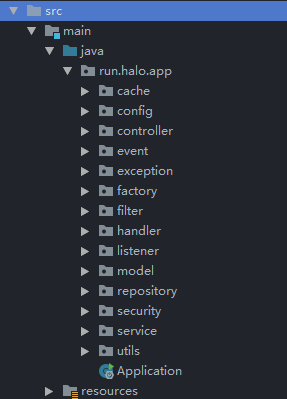

## 查看代码

controller 层，接收前端发来的请求，起调度作用

service 层，服务层，业务代码 / 逻辑代码

repository 存放和 db 交互的代码

model 都是对象，entity 和数据库相关，dto 存放再封装的对象

## 其他组件

util 工具包

security 安全验证

listener 监听器

filter 过滤器

handler 处理器

exception 异常处理

factory 工厂类

cache 缓存

config 配置

## debug

通过前端的输入，通过 url 查找后端 controller 如何接收并处理请求，借鉴一种白盒测试的思路就可以知道内部的逻辑如何跳转的。整个项目结构比较完善，很多地方也是进行了多次的重构。借助 debug 的方式可以较好的知道内部的逻辑，在自己写项目的时候可以借鉴这种思路。

