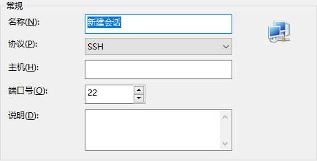

# Linux - 搭建个人网站

## 购买阿里云服务器

学生版有两种：

1. 学生专享-限24周岁以下/阿里云云服务器ECS/专业运维
2. 学生专享-限24周岁以下/阿里云轻量服务器/简单易操作。

### 为啥选择轻量应用服务器

标题写明**专业运维**和**简单易操作**，既然是初次搭建网站，选择容易上手的服务器更佳。就配置而言应付日常练习应该够用，一年114。
补充：如果关心 1000G 的流量问题，经过我的观察，运行服务器第一天，使用流量只有 20M。使用一年绰绰有余。

### 个人总结

在网站初期，访问量不大的时候，服务器的选购可以简单一些。学生练手项目，轻量应用服务器和 ECS 其实差别不大。主要还是熟悉一下项目部署的流程，也能学以致用。一句话：不用太好看/太复杂，能用就行，先跑起来再说。

## 购买域名

花了 5 块买个域名，不过域名备案流程比较长，暂时就先用公网 ip 访问了。

## 连接服务器

三种方式：

1. 阿里云网页点击  `远程连接` 。
2. 本地使用 `Xshell` 和 `Xftp` 软件远程连接和传文件，需要先在阿里云网页设置好密码，此前已经学会如何用 `Xshell` 连接虚拟机，所以还是很简单的。没有学习过的同学可能会花点时间搜索资料，完全不懂就要学会 Google 了。
3. 手机下载 `阿里云app` 在手机端也可以远程访问，当然也是需要输入用户名（我用默认的 root 用户名）和密码。特别是在手机也能远程连接服务器实在是太方便了。

## 部署环节

首先感谢这个教程的 up 主：[https://www.bilibili.com/video/av15159168/](https://www.bilibili.com/video/av15159168/)
走到这一步已经离成功不远了，也是检验 Linux 操作系统知识的时刻。部署步骤可以结合视频观看：

- 本地机器下载软件 `JDK` 和 `Tomcat` 软件，注意是 Linux 下的软件，可以是后缀名为 `tar.gz`。用 `Xftp` 传输到 `/home/pan/` 文件夹中， `pan` 文件夹需要自己创建。
- 移动 `JDK` 到 `/usr/local/` 文件夹下，重命名 tomcat 文件夹。
- 接下来就是复杂的配置 `JDK` 环境变量环节了，按着视频提示敲，注意不要敲错了。里面需要的知识密度还挺大的，比如一些 `vim` 的使用，不过不懂也能部署，照着敲就行了。编辑的文件是 `/etc/profile`，内容如下：（注意使用的 JDK 版本差别）

```bash
export JAVA_HOME=/usr/local/jdk1.8.0_231
export PATH=$JAVA_HOME/bin:$PATH
export CLASSPATH=.:$JAVA_HOME/lib/dt.jar:$JAVA_HOME/lib/tools.jar
```

- tomca/conf/server.xml 文件，将端口 80 改为 8080。

```xml
    <Connector port="80" protocol="HTTP/1.1"
               connectionTimeout="20000"
               redirectPort="8443" />
```

- 远程的服务器在防火墙那里也要开 8080 的端口，自己根据需要修改规则。


- 启动 tomcat：进入 /tomcat/bin/，运行 `./startup.sh` 命令。停止则运行 `./shutdown.sh` 命令。

---

回忆一波 Linux 命令：巧用 `tab` 键可以智能提示，连击两下会有意想不到的提示。

| 操作                     | 命令                      |
| --- | --- |
| 进入某个文件夹 | cd [filename] |
| 创建文件夹 | mkdir [filename] |
| 查看当前文件夹的文件 | ls |
| （查看详细文件夹） | ll |
| （可以看到隐藏的文件夹） | ll -a |
| 解压命令 | tar -zxvf [tar.gz 压缩包] |
| 删除压缩包 | rm [tar.gz 压缩包] |
| 重命名文件夹 | mv [原来的名字] tomcat |
| 打印当前的目录 | pwd |
| 重启 | reboot |
| 立刻关机 | shutdown -h now |


回忆一波 vim 的使用：

|      | 状态                         |
| --- | --- |
| i | 进入编辑状态 |
| ESC | 光标可以移动，可以使用快捷键 |
| : | 即将退出 |


关于 vim 的不多讲，感兴趣的同学得自己查查教程，学会理解三种状态的转换和一些基本使用还是很容易理解的。

1. 在 ESC 状态下，输入 `/Connect` 可以快速查找，按 n 为下一个，按 N 为上一个。
1. 输入 :wq 是强制保存并退出。
1. `shift + g` 到了编辑 `JDK` 环境变量文件 /etc/profile 底部。
| 操作     | 命令          |
| --- | --- |
| 显示行号 | :set number |
| 不显示 | :set nonumber |
| 复制一行 | yy |
| 复制多行 | nyy |
| 粘贴 | p |

## 端口号
HTTP: http://chenbin113.top:80
HTTPS: https://[www.baidu.com:443]()
根据不同的传输协议，默认的端口号不同。此前将 tomcat 的端口号修改为 8080，因此不需要显式写 8080 端口也能默认识别。

### 实验
页面使用 [http://47.103.222.6:8080](http://47.103.222.6:8080) 访问，得到的页面是index.html，是因为配置文件 /tomcat/conf/server.xml 中的 port 修改过。
```xml
<Connector port="8080" protocol="HTTP/1.1"
Socket error Event: 32 Error: 10053.="20000"
Connection closing...Socket close.443" />
```

访问各个端口查看响应
```xml
http://47.103.222.6:8080 访问到的是 index.html，是由于 server.xml 的指向
http://47.103.222.6:8090 访问到博客的网址
http://47.103.222.6:80   无响应
http://47.103.222.6      无响应	
```

## 注意

1. `netstat -a` 命令可以查看服务器监听的端口，排查网络连接的错误非常有用。
1. tomcat 服务器和 jar 包哪个先启动：先启动 tomcat `./startup.sh`，然后才启动 jar 包 `java -jar [jar filename]`。
1. 应该将 jar 包放在 tomcat/webapps/ 目录下。
1. 启动 jar 包后还想要在 Xshell 执行其他命令，参考[[在Linux服务器上运行jar包，并且使jar包一直处于后台执行](https://www.cnblogs.com/weizhxa/p/10014595.html)](https://www.cnblogs.com/weizhxa/p/10014595.html)。启动项目的时候，输入 `nohup java -jar xxx.jar &` ，当前目录下会生成一个 nohup.out 文件。

套用我在另一篇文章的总结：
遇到 bug 的情况千千万，只有**想清楚**最有可能出现问题的地方，**戒急戒躁**，一步一步排查，才能快速定位并修复。
与君共勉！

# Linux - 记录 Xshell 连接 Linux 虚拟机

## 查看 sshd 服务状态

sshd 服务开启时可以使用 Xshell 等工具使用 ssh 方式远程连接

终端输入 `service sshd status` 查看状态，如果没有开启，进入下一步

## 开启 sshd 服务

服务开启：

1. 打开终端
2. 输入 `setup` 命令
3. 查看**系统服务**选项
4. 找到 sshd 选项，查看是否开启，`*` 为开启

注意：空格键，开启/关闭；tab 键，确认 / 取消

## Linux 终端查看 ip

终端输入 `ifconfig`

记录 ip 为 `inet addr:192.168.56.130`

查看 VMware 虚拟网络编辑器，`VMnet8    NAT 模式    NAT 模式    已连接    已启用    192.168.56.0`

联网状态没有问题

## 使用 Xshell 连接



在“新建会话”处填写 Linux 的 ip 地址


在“用户身份验证”处填写登录 Linux 的用户名和登录密码

## 连接成功

```bash
Connecting to 192.168.56.130:22...
Connection established.
```

## 小结

此前远程连接过虚拟机，一段时间没有操作 Linux 系统，后来重连的时候出现问题，也搁置了一天。

昨天自建了一个网站，重新熟悉了 Linux 的操作和一些计算机网络的知识，今天重新排查了一些错误，也总算连接上本地的虚拟机了。

一句话：遇到 bug 的情况千千万，只有想清楚最有可能出现问题的地方，戒急戒躁，一步一步排查，才能修复。

与君共勉！

# Linux - 查看 Tomcat 是否正在运行

命令 `ps -ef | grep java` ，查看到的数据为：

```bash
root      2197     1  0 Nov12 ?        01:08:15 java -jar halo-1.0.3.jar
root      2586  2506  0 19:24 pts/0    00:00:00 grep --color=auto java
```

此时运行的是 `halo` 博客项目的 jar 包，还有查询的这条命令，Tomcat 没有在运行。

使用命令启动 Tomcat，在 `~Tomcat/conf/` 目录下运行 `./startup.sh` 命令，启动后使用命令 `ps -ef | grep java` ，查看到的数据为：

```bash
root      2197     1  0 Nov12 ?        01:08:15 java -jar halo-1.0.3.jar
root      2597     1 16 19:25 pts/0    00:00:02 /usr/local/jdk1.8.0_231/bin/java -Djava.util.logging.config.file=/home/pan/tomcat/conf/logging.properties -Djava.util.logging.manager=org.apache.juli.ClassLoaderLogManager -Djdk.tls.ephemeralDHKeySize=2048 -Djava.protocol.handler.pkgs=org.apache.catalina.webresources -Dorg.apache.catalina.security.SecurityListener.UMASK=0027 -Dignore.endorsed.dirs= -classpath /home/pan/tomcat/bin/bootstrap.jar:/home/pan/tomcat/bin/tomcat-juli.jar -Dcatalina.base=/home/pan/tomcat -Dcatalina.home=/home/pan/tomcat -Djava.io.tmpdir=/home/pan/tomcat/temp org.apache.catalina.startup.Bootstrap start
root      2613  2506  0 19:25 pts/0    00:00:00 grep --color=auto java
```

此时可以看到 Tomcat 的 catalina 已经运行了。

还可以使用上次学习 OOM 学会的命令 `jps` ，得到的结果也是 Bootstrap 已经启动：

```bash
[root@izuf6ab9p10tmh226b05dez bin]# jps
2755 Jps
2197 jar
2733 Bootstrap
```

