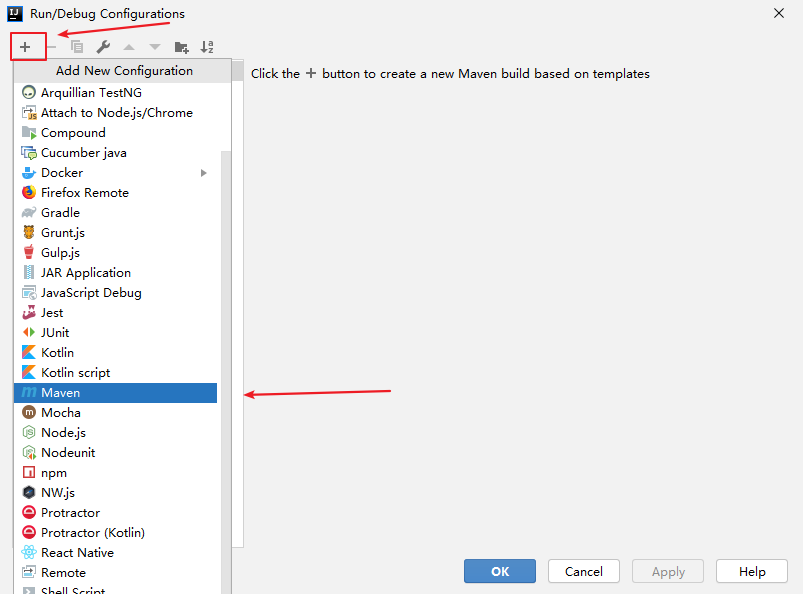
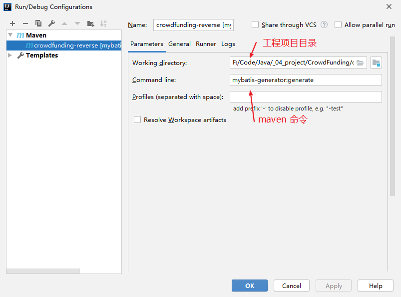
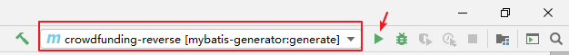

# IDEA - 利用 Mybatis 使用 maven 命令生成逆向工程

## 数据库建表

在本地的数据库建立表，然后利用 Mybatis 使用 maven 命令生成逆向工程。

## 本地使用 maven 建立一个项目

maven 建立项目，pom.xml 文件配置如下：

```xml
<?xml version="1.0" encoding="UTF-8"?>
<project xmlns="http://maven.apache.org/POM/4.0.0"
         xmlns:xsi="http://www.w3.org/2001/XMLSchema-instance"
         xsi:schemaLocation="http://maven.apache.org/POM/4.0.0 http://maven.apache.org/xsd/maven-4.0.0.xsd">
    <modelVersion>4.0.0</modelVersion>

    <groupId>top.chenbin113.crowd.funding</groupId>
    <artifactId>crowdfunding-reverse</artifactId>
    <version>1.0-SNAPSHOT</version>

    <packaging>jar</packaging>


    <!-- 依赖MyBatis核心包 -->
    <dependencies>
        <dependency>
            <groupId>org.mybatis</groupId>
            <artifactId>mybatis</artifactId>
            <version>3.2.8</version>
        </dependency>
    </dependencies>

    <!-- 控制Maven在构建过程中相关配置 -->
    <build>

        <!-- 构建过程中用到的插件 -->
        <plugins>

            <!-- 具体插件，逆向工程的操作是以构建过程中插件形式出现的 -->
            <plugin>
                <groupId>org.mybatis.generator</groupId>
                <artifactId>mybatis-generator-maven-plugin</artifactId>
                <version>1.3.0</version>

                <!-- 插件的依赖 -->
                <dependencies>

                    <!-- 逆向工程的核心依赖 -->
                    <dependency>
                        <groupId>org.mybatis.generator</groupId>
                        <artifactId>mybatis-generator-core</artifactId>
                        <version>1.3.2</version>
                    </dependency>

                    <!-- 数据库连接池 -->
                    <dependency>
                        <groupId>com.mchange</groupId>
                        <artifactId>c3p0</artifactId>
                        <version>0.9.2</version>
                    </dependency>

                    <!-- MySQL驱动 -->
                    <dependency>
                        <groupId>mysql</groupId>
                        <artifactId>mysql-connector-java</artifactId>
                        <version>5.1.8</version>
                    </dependency>
                </dependencies>
            </plugin>
        </plugins>
    </build>


</project>
```


## 建立配置文件

resources 目录下建立 generatorConfig.xml 文件

```xml
<?xml version="1.0" encoding="UTF-8"?>
<!DOCTYPE generatorConfiguration
        PUBLIC "-//mybatis.org//DTD MyBatis Generator Configuration 1.0//EN"
        "http://mybatis.org/dtd/mybatis-generator-config_1_0.dtd">

<!--执行maven逆向工程的命令：mybatis-generator:generate-->
<generatorConfiguration>

    <context id="chenbin113Tables" targetRuntime="MyBatis3">
        <commentGenerator>
            <!-- 是否去除自动生成的注释 true:是;false:否 -->
            <property name="suppressAllComments" value="true" />
        </commentGenerator>

        <!--数据库连接的信息：驱动类、连接地址、用户名、密码 -->
        <jdbcConnection
                driverClass="com.mysql.jdbc.Driver"
                connectionURL="jdbc:mysql://localhost:3306/crowdfunding"
                userId="root"
                password="123qaz">
        </jdbcConnection>

        <!-- 默认false，把JDBC DECIMAL 和 NUMERIC 类型解析为 Integer，为 true时把JDBC DECIMAL 
            和 NUMERIC 类型解析为java.math.BigDecimal -->
        <javaTypeResolver>
            <property name="forceBigDecimals" value="false" />
        </javaTypeResolver>

        <!-- targetProject:生成Entity类的路径 -->
        <javaModelGenerator targetProject=".\src\main\java"
                            targetPackage="top.chenbin113.crowd.funding.entity">
            <!-- enableSubPackages:是否让schema作为包的后缀 -->
            <property name="enableSubPackages" value="false" />
            <!-- 从数据库返回的值被清理前后的空格 -->
            <property name="trimStrings" value="true" />
        </javaModelGenerator>

        <!-- targetProject:XxxMapper.xml映射文件生成的路径 -->
        <sqlMapGenerator targetProject=".\src\main\java"
                         targetPackage="top.chenbin113.crowd.funding.mapper">
            <!-- enableSubPackages:是否让schema作为包的后缀 -->
            <property name="enableSubPackages" value="false" />
        </sqlMapGenerator>

        <!-- targetPackage：Mapper接口生成的位置 -->
        <javaClientGenerator type="XMLMAPPER"
                             targetProject=".\src\main\java"
                             targetPackage="top.chenbin113.crowd.funding.mapper">
            <!-- enableSubPackages:是否让schema作为包的后缀 -->
            <property name="enableSubPackages" value="false" />
        </javaClientGenerator>

        <!-- 数据库表名字和我们的entity类对应的映射指定 -->
        <table tableName="t_admin" domainObjectName="Admin" />

    </context>
</generatorConfiguration>
```

## 执行命令

点击 IDEA 的菜单栏 Run -> Edit Configurations，点击添加按钮如下图：



按照 maven 命令 `mybatis-generator:generate` 如下填写：



## 执行

按照下图执行即可生成逆向工程

