# 日常 - 真随笔

## 对于 JDK 源码的一些误解

这是一篇小记录，起因是看到 Arrays 源码产生的不理解。

```java
/**
 * @since  1.2
 */
public class Arrays {
    public static void sort(int[] a) {
        DualPivotQuicksort.sort(a, 0, a.length - 1, null, 0, 0);
    }
}

/**
 * @since 1.7
 */
final class DualPivotQuicksort {
}
```

Arrays 内部源码居然是后来才写的，让我感到疑惑，后来想明白了，误解之处在于：一直认为 JDK 源码包内容是不能修改的；其实应该这么理解，**Java 不会废除原有的特性**。

像 Python 2.x 到 Python 3.x 那种不兼容问题在 Java 中不能出现，Java 具有向前兼容的特性，对于一些已有的特性，但是不是很好用的，最多也只是添加 @Deprecated 注解不建议使用。但是**可没有说源码不可以修改**，最佳的例子就是 HashMap 1.7 和 1.8 版本之间的跨度，代码从 1000+ 改到 2000+。

Java 语言增加的新特性不会影响原有的特性，就是向前兼容，如同 Interface 中添加的 default 方法。

```java
public interface InterfaceTest01 {
    void fun1();

    default void fun2() {

    }
    
}
```

## 随笔

这篇是自己的一些小结，很多细节没有考证过，如有疏漏请指正为感。

# 日常 - 从 OutOfMemoryError 引发的思考

观看视频学习如何引发 OOM 和排查问题的过程，[视频](https://www.bilibili.com/video/av74026881?t=190)。

通过这个视频的学习还是了解了不少 JVM 的知识以及 debug 的方法，记录如下。

## 问题

常见的有三类：

- java.lang.OutOfMemoryError: Java heap space
- java.lang.OutOfMemoryError: Java metaspace
- java.lang.OutOfMemoryError: Java perm gen

## 实现 OOM

创建一个 OOM.java 文件，内容如下，由于将在命令行窗口执行 java 文件，所以不添加包名：

```java
import java.util.HashMap;
import java.util.Map;

public class OOM {
    public static void main(String[] args) {
        Map cache = new HashMap();
        for (int i = 0; i < 128; i++) {
            cache.put(i, new byte[1024 * 1024]);
        }
    }
}
```

此时使用 javac 命令编译：`javac OOM.java` ，会出现 warning，原因是 Map 没有使用泛型，可以忽略。

使用 java 命令运行 OOM.class 文件，此时需要设定运行内存大小，因为命令会创建的一堆对象大小为 128 m：

```java
F:\Code\Java\java-demo\src\oom>java -Xmx128m OOM
Exception in thread "main" java.lang.OutOfMemoryError: Java heap space
        at OOM.main(OOM.java:8)
```

至此，引发 OutOfMemoryError 成功。

## 拿到 Heap Dump 快照

两个方法：

### 第一

在启动时添加参数，`-XX:+HeapDumpOnOutOfMemoryError` ：

```java
F:\Code\Java\java-demo\src\oom>java -Xmx128m -XX:+HeapDumpOutOfMemoryError OOM
Unrecognized VM option 'HeapDumpOutOfMemoryError'
Did you mean '(+/-)HeapDumpOnOutOfMemoryError'?
Error: Could not create the Java Virtual Machine.
Error: A fatal exception has occurred. Program will exit.

F:\Code\Java\java-demo\src\oom>java -Xmx128m -XX:+HeapDumpOnOutOfMemoryError OOM
java.lang.OutOfMemoryError: Java heap space
Dumping heap to java_pid12992.hprof ...
Heap dump file created [122989308 bytes in 0.114 secs]
Exception in thread "main" java.lang.OutOfMemoryError: Java heap space
        at OOM.main(OOM.java:8)
```

此处我将第一次输入错误也写了进来，是想说明，在实验过程中也会出现错误，而 jdk 会提示我是否想添加那个 `(+/-)HeapDumpOnOutOfMemoryError` 参数，这时候通过报错信息就知道了原来参数写错了，进行第二次输入就正确实现我想要拿到的 Heap Dump 快照，这可以帮助我分析堆内存的信息。

此时目录下多了一个文件 `java_pid12992.hprof` ，在第三步就将学习如何分析这个快照文件。不过在分析前，再尝试一下第二种拿快照的方法。

### 第二

第一种方法是在运行前就添加好快照的参数，但是如果是在一个已经运行的程序上，如何添加参数能够拿到快照呢？

首先，修改上述的文件，使其产生 OOM 的速度慢下来：

```java
import java.util.HashMap;
import java.util.Map;

public class OOM {
    public static void main(String[] args) throws Exception {
        Map cache = new HashMap();
        for (int i = 0; i < 128; i++) {
			Thread.sleep(1000);
            cache.put(i, new byte[1024 * 1024]);
        }
    }
}
```

使用 `jps` 命令可以看到当前运行的 java 进程：

```java
F:\Code\Java\java-demo\src\oom>jps
17160 GradleDaemon
8984 Jps
```

接下来将使用 `jmap` 命令对进程添加快照，先看一下如何使用这个命令：

```java
F:\Code\Java\java-demo\src\oom>jmap -help
Usage:
    jmap [option] <pid>
        (to connect to running process)
    jmap [option] <executable <core>
        (to connect to a core file)
    jmap [option] [server_id@]<remote server IP or hostname>
        (to connect to remote debug server)

where <option> is one of:
    <none>               to print same info as Solaris pmap
    -heap                to print java heap summary
    -histo[:live]        to print histogram of java object heap; if the "live"
                         suboption is specified, only count live objects
    -clstats             to print class loader statistics
    -finalizerinfo       to print information on objects awaiting finalization
    -dump:<dump-options> to dump java heap in hprof binary format
                         dump-options:
                           live         dump only live objects; if not specified,
                                        all objects in the heap are dumped.
                           format=b     binary format
                           file=<file>  dump heap to <file>
                         Example: jmap -dump:live,format=b,file=heap.bin <pid>
    -F                   force. Use with -dump:<dump-options> <pid> or -histo
                         to force a heap dump or histogram when <pid> does not
                         respond. The "live" suboption is not supported
                         in this mode.
    -h | -help           to print this help message
    -J<flag>             to pass <flag> directly to the runtime system
```

输入 `jmap -help` 可以看到很多参数，我挑出里面需要使用的部分：

```java
F:\Code\Java\java-demo\src\oom>jmap -help

    -dump:<dump-options> to dump java heap in hprof binary format
                         dump-options:
                           live         dump only live objects; if not specified,
                                        all objects in the heap are dumped.
                           format=b     binary format
                           file=<file>  dump heap to <file>
                         Example: jmap -dump:live,format=b,file=heap.bin <pid>
```

`jmap -dump:live,format=b,file=heap.bin <pid>` 记住这个命令，等会儿运行的时候需要添加这个。

像第一种方法一样编译，运行：

```java
// compile
F:\Code\Java\java-demo\src\oom>javac OOM.java 
// run
F:\Code\Java\java-demo\src\oom>java -Xmx128m OOM

······ // will wait about two minutes, and then print OutOfMemoryError

Exception in thread "main" java.lang.OutOfMemoryError: Java heap space
        at OOM.main(OOM.java:9)
```

这时候需要打开另一个命令行窗口，使用 `jps` 查看运行的进程号码，这个号码是后面的 pid 参数：

```java
F:\Code\Java\java-demo\src\oom>jps
16272 OOM
8592 Jps
17160 GradleDaemon

```

输入参数：

```java
F:\Code\Java\java-demo\src\oom>jmap -dump:live,format=b,file=16272.hprof 16272
Dumping heap to F:\Code\Java\java-demo\src\oom\16272.hprof ...
Heap dump file created

```

此时参看目录可以看到，存在两个快照，分别是使用两种方法做到的：

```java
2019/11/30  14:10       105,162,801 16272.hprof
2019/11/30  13:50       122,989,308 java_pid12992.hprof
2019/11/30  14:08               651 OOM.class
2019/11/30  14:07               307 OOM.java

```

### 说明

这些方法是 HotSpot 虚拟机的参数，也就是在其他虚拟机上可能不适用相同的步骤和参数拿到 Heap Dump 快照。

JVM 丢出了 OOM，但是 JVM 仍然在运行，只是由于内存不足响应比较慢，这时候如果存在一些不耗内存的操作仍然可以执行。

## 分析 OOM

OOM 是怎么产生的？

需要知道 GC 原理，GC 对垃圾的判断是对内存的对象进行可达性分析，GC Roots 对象被认为是起始点，从 GC Root 出发，一直向下搜索。GC Root 可达的对象就不需要回收，其他对象进行清理。

此时有可能出现一些对象一直没有被清理的情况，heap 满，产生 OOM。

也有可能是新建的对象太大，而 heap 没有一大片空间可以容纳（由于此前的清理使得 heap 空间呈碎片化），此时产生 OOM。

总结产生 OOM 的原因：50% 代码问题（本例的 OOM.java），40% 配置问题（本例的 -Xmx128m），10% 内存真的不够。

## 分析快照常用工具

### VisualVM

VisualVM，JDK 9+ 的版本需要自己下载，本机使用的是 JDK 8，命令行输入 `jvisualvm` 就可以调用了。

- 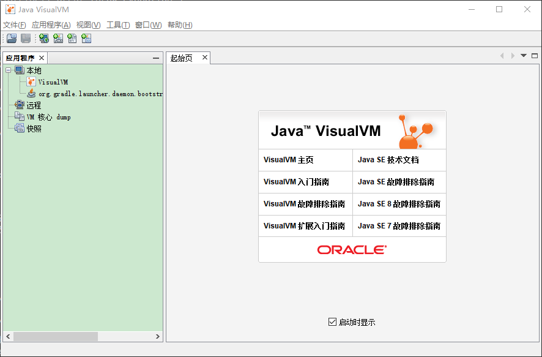

  

先看一下 JDK 自带的 VisualVM，进入 JDK 的 bin 目录下，看一下常用的程序：`C:\Program Files\Java\jdk1.8.0_221\bin`

| 程序          | 作用                           |
| ------------- | ------------------------------ |
| jar.exe       | 打包                           |
| java.exe      | 启动虚拟机，运行字节码文件     |
| javac.exe     | 编译 java 文件                 |
| javadoc.exe   | 生成 api 文件                  |
| javap.exe     | 反编译，查看字节码             |
| jcmd.exe      | 对运行的虚拟机发命令           |
| jdb.exe       | 调试                           |
| jmap.exe      | 创建快照 Dump                  |
| jps.exe       | 当前计算机运行的所有 java 进程 |
| jstack.exe    |                                |
| jstat.exe     | 查看整个 jvm 的状况            |
| jvisualvm.exe | 调用 VisualVM                  |

简单查看程序的运行发生了什么，输入命令 `jvisualvm`，命令行窗口运行 `java -Xmx128m OOM`，此时可以看到本地出现了 OOM 这个进程，双击可以连接，然后看到启动时虚拟机输入的参数。

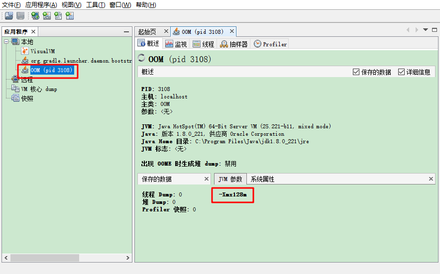

点开监视可以看到堆 Metaspace 是逐渐变大的。

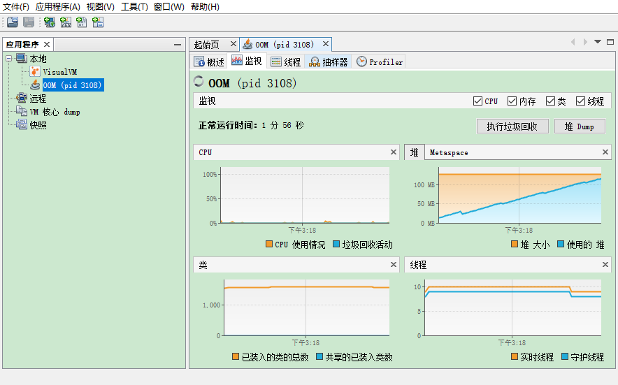

选择装载刚才的快照 Heap Dump，可以进一步查看里面的情况：

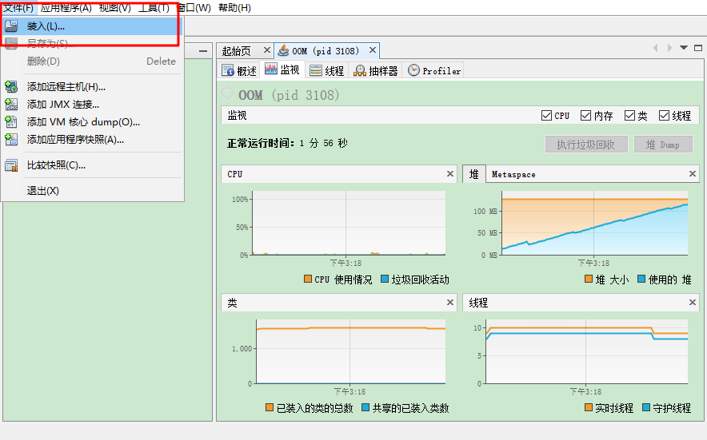

可以看到占据内存最多的是 `byte[]`，

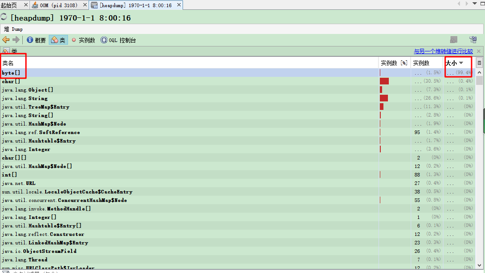

### MAT

Eclipse 开源的 Memory Analyzer，可以从官网下载。导入刚才的快照。

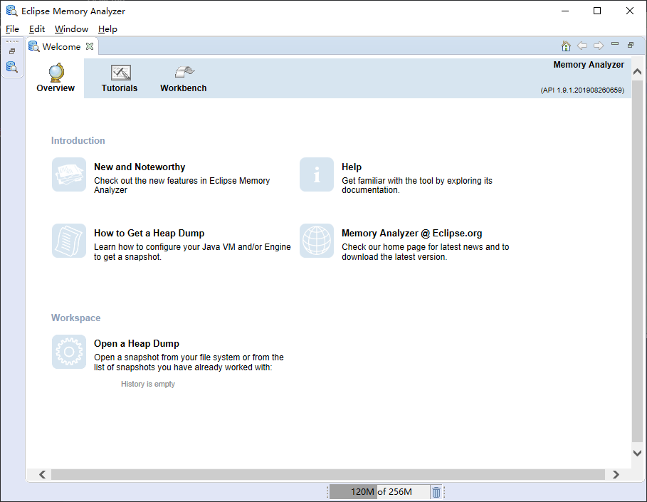

下面两个主要的区域是分析快照的地方：

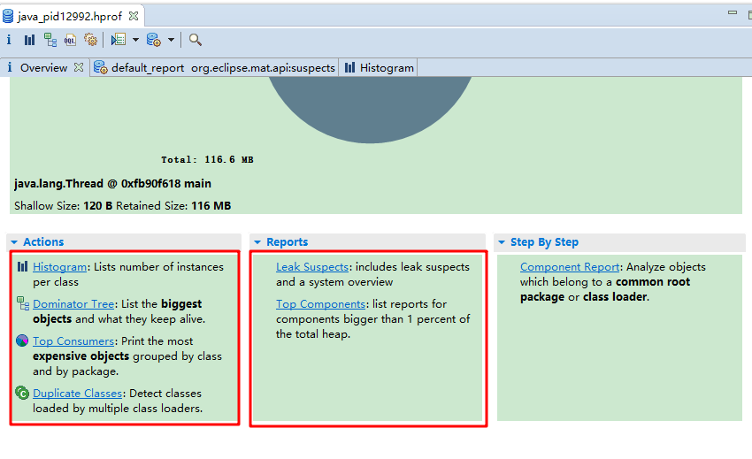

#### Histogram

主要查看和筛选出引发 OOM 的 Class 对象。其统计了每个类的实例对象，可以看到有 Shallow Heap 和 Retained Heap 两个部分。

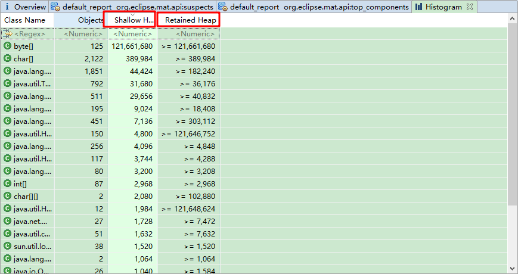

retained 的概念想通过以下的叙述解释：假设 A 对象需要被回收，这时候可以同时回收 A、C、E 三个对象，这时候的 Retained Heap 相应就比较大。

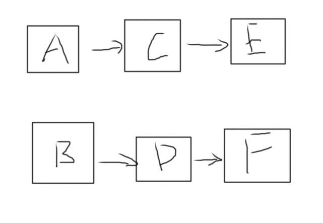

如果是下面的情况，则只能回收 A 对象，因为 B 对象指向了 C 对象，这时候的 Retained Heap 相对应就变小了。

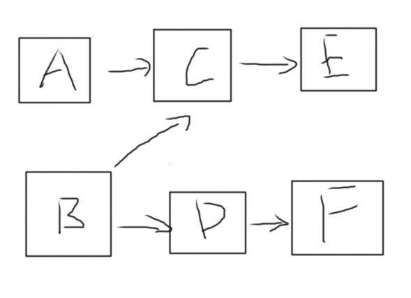

#### Dominator Tree

占据内存空间很大的对象以及使他们一直存在的原因是什么，截了个图，可以看到是 main 线程保留着这些对象

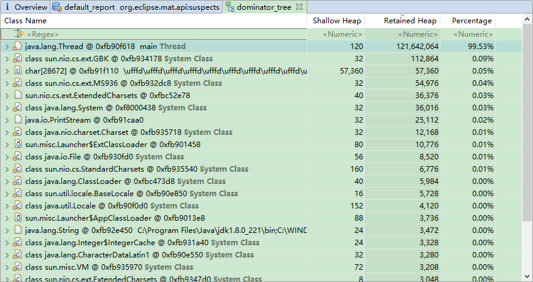

#### Leak Suspects

也是主要使用的功能，可以分析可能发生溢出的原因。

#### Top Components

给出占据堆内存超过 1% 的组件。

## Heap Dump 分析

一般来说有两个原因导致 heap 溢出：

Metaspace / PermGen —— Class 对象没有被正确的释放，尤其是 ClassLoader，一般来说自己不写 ClassLoader 里面最多只有几十个

Heap space —— 瞄准占空间最大的对象

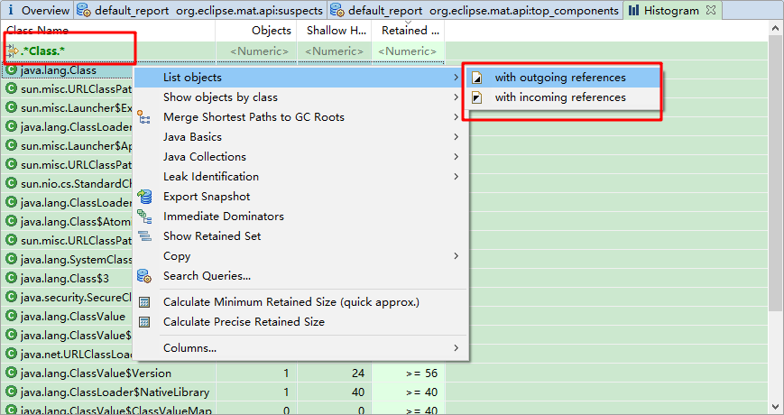

通过这些工具的查看，找到溢出的 Class 对象，使用 `Merge Shortest Paths to GC Roots` 功能就可以找到一些 `Path to GC Roots` 路径，这些路径显示了这些对象是如何相互引用以及避免了垃圾回收，最终引发 OOM 的 Error 信息。找到这些信息后，通过修改代码规避这些问题，修复这些 bug。

# 日常 - jps 命令

## 问题产生
今天使用 idea 运行一个程序来使用 JVM 的一些参数，中途 idea 突然退出，之后使用 jps 命令发现程序仍在运行。以下是使用 Terminal 终端查看记录：

```java
>>jps
11712 HelloGC
11728 HelloGC
12720 KotlinCompileDaemon
6560 Jps
1860 Launcher
9288 RemoteMavenServer
13516
```

## shutdown 的方法

由于是在 Windows 环境下，打开了 Windows PowerShell，输入 kill 11712 命令关闭了另一个正在运行的 HelloGC 程序。