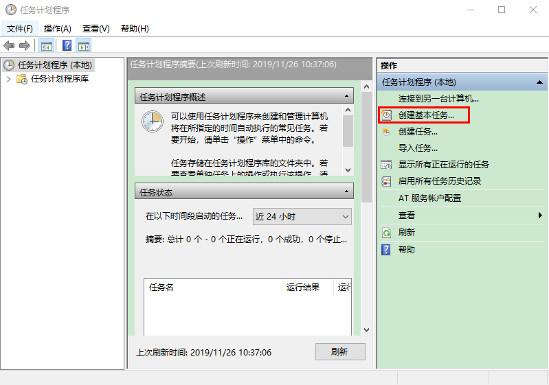
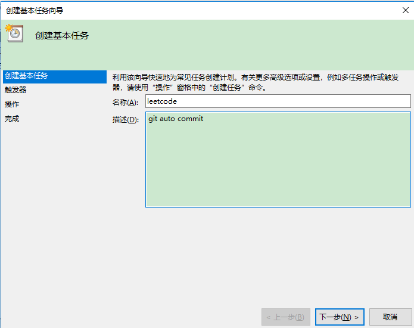
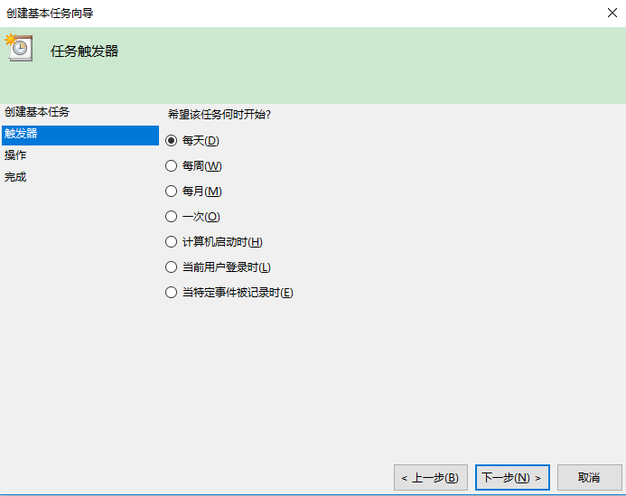
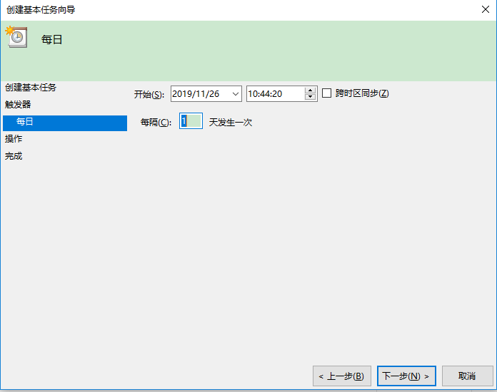
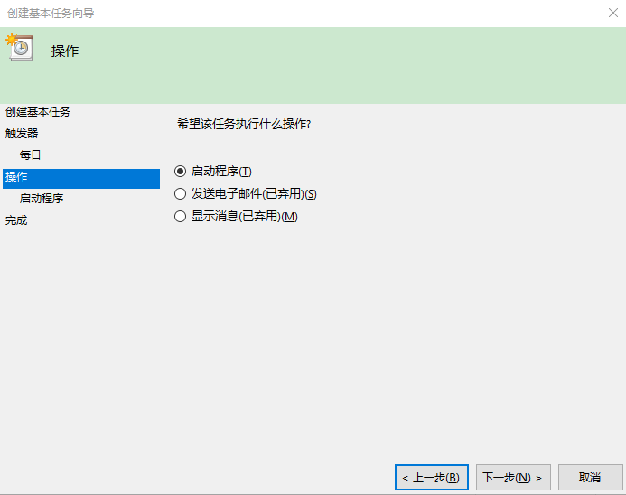
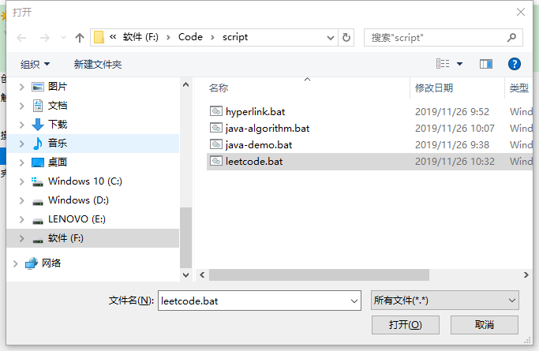
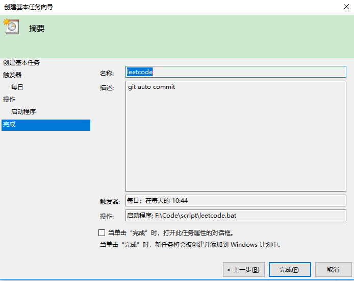
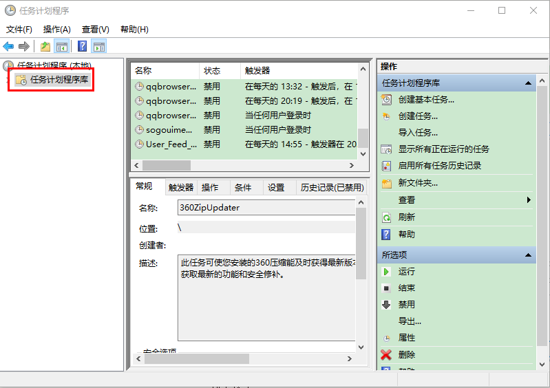

# 日常 - 真随笔

## 对于 JDK 源码的一些误解

这是一篇小记录，起因是看到 Arrays 源码产生的不理解。

```java
/**
 * @since  1.2
 */
public class Arrays {
    public static void sort(int[] a) {
        DualPivotQuicksort.sort(a, 0, a.length - 1, null, 0, 0);
    }
}

/**
 * @since 1.7
 */
final class DualPivotQuicksort {
}
```

Arrays 内部源码居然是后来才写的，让我感到疑惑，后来想明白了，误解之处在于：一直认为 JDK 源码包内容是不能修改的；其实应该这么理解，**Java 不会废除原有的特性**。

像 Python 2.x 到 Python 3.x 那种不兼容问题在 Java 中不能出现，Java 具有向前兼容的特性，对于一些已有的特性，但是不是很好用的，最多也只是添加 @Deprecated 注解不建议使用。但是**可没有说源码不可以修改**，最佳的例子就是 HashMap 1.7 和 1.8 版本之间的跨度，代码从 1000+ 改到 2000+。

Java 语言增加的新特性不会影响原有的特性，就是向前兼容，如同 Interface 中添加的 default 方法。

```java
public interface InterfaceTest01 {
    void fun1();

    default void fun2() {

    }
    
}
```

## 随笔

这篇是自己的一些小结，很多细节没有考证过，如有疏漏请指正为感。

# 日常 - 在 Windows 系统下使用批处理文件自动提交代码到 GitHub 上

## 需求

每天都上传代码到 GitHub 上，需要一种脚本文件自动完成一些重复的工作。

- git add .
- git commit -m "message"
- git push

缺点是上传的 message 都为 "auto commit"，违背了代码管理的初衷，以后查看这些 message 很难知道当时修改了什么内容。

经过测试可得，如果当天没有修改项目文件内容，则不会完成 add commit push 操作。因此也可以在需要记录的当天手动执行 commit，加上一些必要的 message 信息，批处理文件则会完成 push 操作。

此前准备，需要已经配置好手动完成 push 到远程仓库的操作，在这种条件下才能完成自动化脚本的正确运行。

## 实现

### 编写文件

- 先在 Windows 下创建一个 `leetcode.txt` 文件，并输入以下内容。完成后更改文件内容后缀名，使其变成 `leetcode.bat` 批处理文件。

```bash
@echo off
@title bat execute git auto commit
F:
cd F:/Code/Java/algorithm/leetcode
git add .
git commit -m "Auto commit."
git push
```

- 解释说明：再次强调，如果看了这些解释仍不清楚 bat 文件的作用则需要先手动 commit 到 GitHub 上。

```bash
@echo off #打开回显或关闭请求回显功能，off 可以改成 on。
@title bat execute git auto commit #运行时命令行窗口的 title
F:
cd F:/Code/Java/algorithm/leetcode #这里是要提交的项目目录，需要更改成自己的文件目录
git add .
git commit -m "Auto commit."
git push #git 命令
```

### 使用 Windows 的任务计划程序

- 创建基本任务



- 填写信息



- 设置触发器为每天启动



- 设置每天启动的时间



- 设置操作



- 配置刚才写的脚本文件 `leetcode.bat` 



- 完成



### 查看

- 可以在任务计划程序库查看是否成功添加



# 日常 - 如何学习一个项目

假设已经找到了一个完整的项目，用 maven 或者是 gradle 管理，使用了 MVC 的模式。以 [halo](https://github.com/halo-dev/halo) 博客系统为例。

## 查看依赖

通过 maven 或 gradle 的配置查看项目依赖了哪些组件。

## 运行项目

Spring Boot 的项目在 src 目录下有一个 application 入口，可以据此运行整个项目。

查看 resources，配置文件等非代码的配置文件。

## 查看代码

controller 层，接收前端发来的请求

service 层，服务层，业务代码 / 逻辑代码

repository 和 db 交互的代码

model 都是对象，entity 数据库相关，dto 封装一层对象；maven 是 bean

## 其他组件

util 工具包

security 安全验证

listener 监听器

filter 过滤器

handler 处理器

exception 异常处理

factory 工厂类

cache 缓存

config 配置

