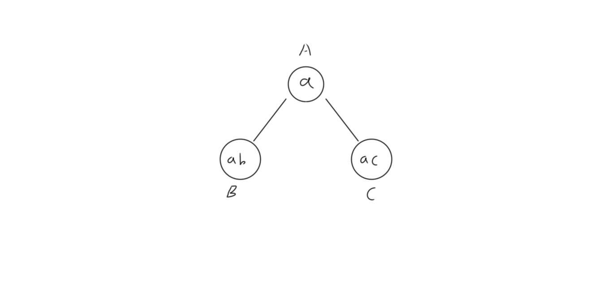

# git - 初级

# 常用命令

## git init                

可以初始化一个本地的 git 仓库，将创建一个 `.git` 隐藏文件夹，存储本地多次提交的历史信息。

## git clone

git clone  [url] ：GitHub 上每一个项目都有一个 url，使用这个命令可以从远程克隆一个仓库。

git clone 也可以从本地一个目录克隆到另一个目录：

- 创建 test 文件夹，并使用 git init 命令
- 使用 git clone test test2 命令克隆本地仓库，报出 warning 称克隆了一个空的文件夹

```bash
$ mkdir test
$ cd test
$ git init
$ git clone test test2
Cloning into 'test2'...
warning: You appear to have cloned an empty repository.
done.
```

## git add

git add . 将添加**所有**文件到暂存区，git add [filename] 将添加某个文件到暂存区。

```bash
$ touch a
$ touch b
$ git add .
$ git reset HEAD b
```

创建了文件 a 和文件 b，添加两份文件进入暂存区，但是想撤销添加文件 b，可以使用撤销添加的命令：git reset HEAD [filename] ，此时暂存区就只添加了文件 a。git 给了很充分的提示：

```bash
$ git status
On branch master
Your branch is up to date with 'origin/master'.

Changes to be committed:
  (use "git reset HEAD <file>..." to unstage)

        new file:   a

Untracked files:
  (use "git add <file>..." to include in what will be committed)

        b
```

## git status

在上面的 `add` 操作中，使用了 git status 查看当前文件的状态，其实可以使用 `git status -s` 命令得到更加简短的输出：

```bash
$ touch a.txt
$ git status -s
?? a.txt # ?? 表示文件还没有添加进入暂存区

$ git add a.txt
$ git status -s
A  a.txt # A 表示文件已经添加进入暂存区

$ vim a.txt
$ git status -s
AM a.txt # AM 表示文件添加进入暂存区后又进行了修改
```

## git commit

git commit -m "message" ：提交暂存区的文件到本地仓库

git commit --amend：修改当前提交的 commit，会形成另一个 commit

git reset origin/master --hard：可以恢复到原来的 commit

## git log

git log 可以查看 commit 的所有记录

git log --oneline 则以一行的形式简短展示每次 commit

git log --graph 则是以图的形式展示了分支的拓扑图

```bash
    file
      ↓   git add 
————————————
|  暂存区   |
————————————
      ↓   git commit
————————————
|   仓库    |
————————————
      ↓   git push
————————————
|  远程仓库  |
————————————
```

## git remote

git remote 命令查看当前本地仓库连接了哪些远程仓库

git remote -v 则显示更为详细的信息

## git push

git push 是将本地仓库和远程仓库连接的重要命令，以 GitHub 的连接为例，需要先在 GitHub 上创建一个空的远程仓库，接下来会提示你如何连接：

```bash
# 本地没有仓库时需要做的
echo "# test" >> README.md
git init
git add README.md
git commit -m "first commit"
git remote add origin git@github.com:ChenBin113/test.git
git push -u origin master

# 本地有仓库需要做的
git remote add origin git@github.com:ChenBin113/test.git
git push -u origin master
```

主要是第一次连接需要添加远程仓库的地址，以后只需要在 commit 命令后使用 git push 命令即可。

网络不稳定，偶尔会出现 push 不成功的现象，隔一段时间重新 push 即可；或者在项目目录下有隐藏文件夹 .git，进入其中修改 config 文件，使用命令为 `vim .git/config`。

将其 `url = git@github.com:ChenBin113/test.git` 修改为 `url = https://github.com/ChenBin113/test`，即可使用 https 协议进行 push。

## git reset

git reset [id] 可以回退未 push 的版本；窗口没有关闭时，仍能撤销回退，只要记得版本 id 号就行

git reset origin/master --hard 可以回退到 origin/master 版本

# git - 高级

# 常用命令

## 创建分支 - git branch

单纯的使用 git branch 命令会显示当前的分支名称，使用 git branch feature1 创建了一个名为 feature1 的分支，git checkout feature1 表示切换到 feature1 分支，git checkout -b feature2 则是上述两个命令的结合，创建并切换到 feature2 分支。

```bash
$ git branch # 查看
* master

$ git branch feature1 # 创建
$ git branch
* master
  feature1

$ git checkout feature1 # 变更
Switched to branch 'feature1'

$ git checkout -b feature2 # 创建 + 变更
Switched to a new branch 'feature2'
```

## 删除分支 - git branch -d

## 合并分支 - git merge

```bash
$ git branch
* feature2
  feature1
  master

$ git merge feature1 # 此时需要填写 merge 信息，然后就成功将 feature1 的内容合并到 feature2 中

$ git branch -d feature1 # 此时 feature1 就消失了，后面的编号代表它 commit 的值前 7 位
Deleted branch feature1 (was 651f232).
```

## 分支合并时冲突

分支合并时冲突主要表现在，两个分支对一份文件有不同的修改，分支 A 中文件写的是 a，分支 B 中文件写的是 ab，分支 C 中文件写的是 ac，合并的时候内容就产生冲突，这时候就需要手动修改内容，完成合并的过程。



```bash
# 在 A 分支写下 a.txt 文件，内容是 a
$ git branch
* A
$ cat a.txt
a

# 创建 B 分支，修改 a.txt 文件，内容是 ab
$ git checkout -b B
Switched to a new branch 'B'
$ cat a.txt
ab
$ git branch
  A
* B

# 回到 A 分支，创建 C 分支，修改 a.txt 文件，内容是 ac
$ git checkout A
Switched to branch 'A'
$ git checkout -b C
Switched to a new branch 'C'
$ cat a.txt
ac

# 回到 B 分支，合并 C 分支，此时产生冲突
$ git checkout B
Switched to branch 'B'
$ git merge C
Auto-merging a.txt
CONFLICT (content): Merge conflict in a.txt
Automatic merge failed; fix conflicts and then commit the result.

# 查看冲突的文件内容，不做修改，重新 commit
$ vim a.txt
<<<<<<< HEAD
ab
=======
ac
>>>>>>> C

$ git add .
$ git commit -m "abc"

# 此时可以看到合并已经完成
$ cat a.txt
<<<<<<< HEAD
ab
=======
ac
>>>>>>> C

$ git log
commit 6019def448ca10da6aa462c0b1ed7f1b1a768bbd (HEAD -> B)
Merge: b088741 fa4d442
Author: ChenBin113 <m13680309305_1@163.com>
Date:   Sun Dec 1 17:55:05 2019 +0800

    abc

commit fa4d442a66125c89af5cabf946a669af9ba256ba (C)
Author: ChenBin113 <m13680309305_1@163.com>
Date:   Sun Dec 1 17:53:06 2019 +0800

    ac

commit b088741babb987489d27a558978b63df3144ba0e
Author: ChenBin113 <m13680309305_1@163.com>
Date:   Sun Dec 1 17:50:34 2019 +0800

    ab

commit d34197eb7937fb2198676e8b9f2c80e061433f96 (A)
Author: ChenBin113 <m13680309305_1@163.com>
Date:   Sun Dec 1 17:40:25 2019 +0800

    A: a

# 删除 C 分支
$ git branch -d C
Deleted branch C (was fa4d442).
```

## git tag

git tag -a v1.0 表示对当前的 commit 打上 tag 为 v1.0 的标记，通常用来记录重大的版本发布。

# git - IDEA

## Annotate

在我本地的项目 java-demo 中是建立了一个 git 仓库，每次提交代码都会在里面建立了一个快照，使用 IDEA 打开这个项目，在代码行处右键打开 Annotate 选项就看到对这份文件每次修改的代码和时间戳，点击里面的某一行还能看到提交这个 commit 的同时整个项目有哪些文件进行修改。


使用 `git checkout [SHA-1]` 可以返回某个状态的 commit。

接下来我做了一些实验：

```bash
# 第一次，查看 git log
~/leetcode (master)
$ git log
commit ce96adc13c17d6cb58c8d9574569a311d1bc7d38 (HEAD -> master, origin/master)	

# 回到之前提交的某一个 commit
~/leetcode (master)
$ git checkout bd25
Note: checking out 'bd25'.

# 第二次，查看可知，已经跳到了 'bd25' 的 commit 了，此时 commit 只有 HEAD 指针
~/leetcode ((bd2512a...))
$ git log
commit bd2512a86fe3da8ddfa6a35db9a105e950fbd83d (HEAD)

# 回到 master 所在的 commit 编号，命令解释说 HEAD 指针已经完成跳转
~/leetcode ((bd2512a...))
$ git checkout ce96
Previous HEAD position was bd2512a Add array part.
HEAD is now at ce96adc Auto commit.

# 查看此时的状态
~/leetcode ((ce96adc...))
$ git status
HEAD detached at ce96adc
nothing to commit, working tree clean

# 第三次，和第一次比较的不同在于，第一次括号内是 master，现在是 commit 编号，此前是 (HEAD -> master, origin/master) 现在是 (HEAD, origin/master, master)
~/leetcode ((ce96adc...))
$ git log
commit ce96adc13c17d6cb58c8d9574569a311d1bc7d38 (HEAD, origin/master, master)

# 回到 master 分支
~/leetcode ((ce96adc...))
$ git checkout master
Switched to branch 'master'
Your branch is up to date with 'origin/master'.

# 第四次，可以看到现在已经和第一次查看到的内容完全一致了
~/leetcode (master)
$ git log
commit ce96adc13c17d6cb58c8d9574569a311d1bc7d38 (HEAD -> master, origin/master)
```

将一个个 commit 视作链表中的一节，HEAD 指针一共移动了三次，`ce96` 这个 commit 有多个指针指向它。


## HEAD - master - origin/master


这三者的关系单独来说明：

### HEAD

每一条分支都有一个 HEAD 指针，指向正在操作的当前的 commit。如图所示，此时 HEAD 指针指向的 commit 为 `b9df6a4a` 。


使用 `git reset 651f` 命令，此时 HEAD 指针指向的 commit 为 `651f2326` 。


### master

上述案例可以看到，HEAD 指针随 reset [id] 号而移动，master 却还是 master，这是因为 master 属于 branch，而 HEAD 无论怎么移动都在 master 分支掌控之中。现在我们来改变 branch，使用 git checkout feature1 将分支转换为 feature1 分支。此时 HEAD 又变了指向，这说明一个项目中 HEAD 只会指向一个 commit，它始终起到指示当前操作的 commit 的作用。master 这时候仍然还在原来的位置，可以推断，切换回 master 分支的时候仍然从那个位置开始操作。


### origin/master

这个标识着本地分支 master 在远程仓库 origin 同步的 commit，在上面的图片还能看到 origin/feature1，这说明远程仓库有两个分支，经验证猜想也是正确的。


### tag

此时输入了 `git tag -a v1.0` 命令，tag 其实也是一种标识的作用，一般都是用来标记版本，毕竟一个个 commit 的 id 虽然可以保证不重样，但是却难记住。就好像 ip 和域名一样，tag 就是好记的域名 www.baidu.com 。

### 总结

IDEA 非常贴心，将这些标签是整得明明白白，一共就四样：无处不在的 HEAD，绿色的 branch，紫色的远程仓库标签，灰色的 tag 标签。它们统一作用在 commit 上面，所以 commit 才是终极 boss，标签再多还是围绕它转。


## 写在最后

以上就是我在学习 git 和 GitHub 的一些小结，为什么萌发学习的念头呢？因为在 GitHub 上看大公司的项目才体会到 git 和 GitHub 的大用处，这确实是现在我这个阶段所接触不到的。

正如我之前的项目截图，git 成为我一个代码记录的工具，根本用不到 merge 这些比较复杂的操作，甚至后面都使用脚本自动提交了。直到我看到一些大牛在为大公司修 bug 时才发现，大公司的项目就是最好的学习资料，在看那些项目和 issue 的时候才发现对 git 和 GitHub 了解太少了。


最后放一个图，是 alibaba 的 fastjson 的，直到看到这个，才明白 git 的能力。

