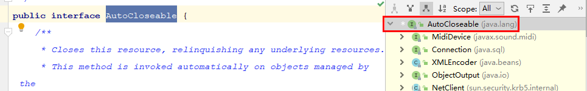

# javase

## 概述

### Java 相关

Java 有三个方向：
- JavaSE（Java Platform，Standard Edition），这个部分是 Java 语言的基础知识，需要牢固掌握，后期的框架都是基于这些基础之上发展的，属于Java语言的地基；学习 Android 开发也需要学习这部分知识。
- JavaEE（企业级 enterprise），这个是 JavaSE 的发展，是企业级应用。这部分的知识有：HTML，CSS，JavaScript，Ajax，JDBC，SQL，Json，Servlet，JSP，maven 等等。通过学习这部分知识，建立一种客户端和服务器端交互的模型。
- JavaME，是为机顶盒、移动电话和 PDA 之类嵌入式消费电子设备提供的 Java 语言平台，包括虚拟机和一系列标准化的 Java API。

JavaEE 已由 Oracle 交给 Eclipse 基金会管理，改名为 JakartaEE。

### Java 开发

JDK（Java Development Kit），是一套开发工具箱，能开发也能运行，**开发＋运行**；JRE（Java Runtime Environment），Java 的运行环境。

JRE 的存在，解决了一些企业没有开发的需求，只有运行 Java 程序的需求的问题。

JVM（Java Virtual Machine），Java 的虚拟机，程序 .java 文件经过编译之后成为 .class 文件，在虚拟机上运行。不同的操作系统（Windows，Linux，MacOS···）对应的虚拟机不相同，正是由于虚拟机的存在，保证同一份 .class 文件可以在不同的操作系统上运行。虚拟机可以看做操作系统和 .class 文件的**翻译机**。

### 常用 DOS 命令

| 功能                                     | 如何实现                      |
| ---------------------------------------- | ----------------------------- |
| 进入不同的磁盘                           | D:                            |
| 查看当前目录所有文件和文件夹             | dir                           |
| 创建文件夹                               | md test                       |
| 进入文件夹                               | cd test                       |
| 退回到上一级目录                         | cd..                          |
| 删除文件                                 | del test.txt                  |
| 删除多个同类型文件                       | del *.txt                     |
| 删除空文件夹                             | rd test                       |
| 删除非空文件夹，使用下列命令后提示选择 Y | del test                      |
| 读取文件内容                             | more [file]                   |
| 编译 java 文件                           | javac *.java                  |
| 运行字节码文件                           | java *(不需要扩展名)          |
| 清空当前命令行窗口                       | cls                           |
| 智能补全命令，常用来补全文件名           | tab                           |
| 查询 ip 相关配置                         | ipconfig（Linux 为 ifconfig） |

进入一个空的文件夹后使用 `dir` 命令可以看到两个 `dir` 文件 `.` 和 `..` ，分别代表本级文件夹和上一级文件夹。

### 如何准备开发 Java 程序的环境

首先，去 Oracle 官网下载 JDK。JDK 里面的文件：


- bin：包含一些可执行文件
- include：包含一些 C 语言的头文件
- jre：JDK 包含 JRE，开发 + 运行
- lib：一些 jar 包，虚拟机运行需要的文件
- src：源文件，非常重要的 .java 文件

其次，配置环境变量，确保可以直接使用 `java` 、`javac` 等命令。环境变量具体配置可以搜素相关的网页，在未来的使用中，配置环境变量非常常见，需要掌握快速配置环境变量的能力，因此，最好对配置环境变量的作用进行理解。环境变量的作用相当于告诉系统到哪里可以调用程序，javac、java 命令都是 JDK bin 文件夹下的可执行文件。


### 第一个 Java 文件

```java
public class MainTest {
    public static void main(String[] args) {
        System.out.println(args[0]);
        System.out.println(args[1]);
    }
}
```

public，权限修饰符，修饰的类类名需要跟文件名一致，而且一个 .java 文件只能有一个 public 类，可以有多个其他类，在编译的过程中一个 java 文件会产生多个 class 文件。

初学 Java，会先使用 command 窗口执行 .java 文件。通过 `win + r` 以及输入 `cmd` 命令可以调出 Windows 操作系统的命令行窗口。命令行窗口使用 DOS 命令（Disk Operating System 磁盘操作系统），以下是刚开始使用 Java 过程中常用的命令。

```bash
cmd:
javac MainTest.java //注意文件名有无后缀
java MainTest "hello" "world"

output:
"hello"
"world"
```

使用的 `java [-options] class [args...]` 输入了两个参数，在 java 程序的逻辑中将两个参数逐个打印出来。

### 使用 javadoc 命令制作 java 文件中文档注释

写好 Hello.java 文件，在文件当前目录下调出命令行窗口，使用 `javadoc -d mydoc -author -version Hello.java` 命令，即可制作 Hello.java 的 api 文档。

## 语言基础

### 基本概念

**关键字：**51 个，可以参考 https://docs.oracle.com/javase/tutorial/java/nutsandbolts/_keywords.html

> Here is a list of keywords in the Java programming language. You cannot use any of the following as identifiers in your programs. The keywords `const` and `goto` are reserved, even though they are not currently used. `true`, `false`, and `null` might seem like keywords, but they are actually literals; you cannot use them as identifiers in your programs.


**标识符：**英文，数字，下划线，美元符号；不能以数字开头；见名知意；能自己定义的就是标识符。

**字面值：**不能改变的值，和常量 `private static final int var = 0;` 区分；字面值有

1. 字符

2. 字符串

3. 小数

4. 整数

5. 布尔值

6. null

**变量：**和常量区分开，是一个指引；目的是重复利用字面值，节省内存空间；变量在同一作用域（同一个括号对）不能重复定义。

```java
//这两个循环隶属不同括号对
for (int i = 0; i < 10; i++) {
}
for (int i = 0; i < 10; i++) { 
}
```


### Java 数据类型


不同的数据类型，使计算机更好的分配内存。

**基本数据类型**

|         | 内存空间        | 数值范围         | 符号位 | 备注                                                       |
| ------- | --------------- | ---------------- | ------ | ---------------------------------------------------------- |
| 整数    |                 |                  |        |                                                            |
| byte    | 1 个字节，8 位  | -2^7^ ~ 2^7^-1   | 有     |                                                            |
| short   | 2 个字节，16 位 | -2^15^ ~ 2^15^-1 | 有     |                                                            |
| int     | 4 个字节，32 位 | -2^31^ ~ 2^31^-1 | 有     |                                                            |
| long    | 8 个字节，64 位 | -2^63^ ~ 2^63^-1 | 有     | 程序会默认将整型的字面值当做 int 类型，此时需要加“L”       |
| 浮点    |                 |                  |        | BigDecimal：数字精度高可用                                 |
| float   | 4 个字节        |                  | 有     | 程序会默认将小数的字面值当做 double 类型，此时需要加“F”    |
| double  | 8 个字节        |                  | 有     |                                                            |
| 字符    |                 |                  |        | 'A'=65 'a'=97 '0'=48；有且只有一个字符，不能为空，用单引号 |
| char    | 2 个字节        | 0~2^16^-1        | 无     | 汉字占两个字节，所以刚好可以存储一个汉字                   |
| 布尔    |                 |                  |        | true 和 false，在 JVM 中用 int 的 0 和 1 代表              |
| boolean |                 |                  |        | 没有明确说明 Boolean 类型占多少字节                        |

### 转换规则

- 8 种基本数据类型除 boolean 类型之外都可以相互转换
- 小容量向大容量转换叫做**自动类型转换**：byte < short(char) < int < long < float < double

	- byte,short,char 做混合运算的时候，各自都先转换成 int 再做运算

	- 多种数据类型做混合运算，先转换成容量最大的那种再做运算
- **强制类型转换：**
  - 大容量向小容量转换是，需要加强制转换符。编译虽然通过，运行期可能损失精度。谨慎使用
  - 另一种如其名，就为了强制将类型转换为某种自己要的类型
- 如果整数 int 没有超出 byte,short,char 的取值范围（这个不是自动类型转换），可以直接将这个整数赋值给 byte,short,char

```java
long l = 888; //系统还是识别为整型 int，赋值时候做了转换；证据就是超过 int 范围会报错
long longl = 2147483647;
long long2 = 2147483648; //此处报错

long longl = 2147483647;
long long2 = 2147483648L; //此处不报错
```

浮点数除 0：

```java
double d1 = 1.0;
double d2 = 0.00;
double d3 = d1 / d2;
System.out.println(d3); //output: Infinity
//System.out.println(d3 instanceof Double); //Error，instanceof 不能比较基本数据类型
System.out.println(d1 / d2); //output: Infinity

Double d1 = 1.0;
Double d2 = 0.00;
Double d3 = d1 / d2;
System.out.println(d3); //output: Infinity
System.out.println(d3 instanceof Double); //true
System.out.println(d1 / d2); //output: Infinity
```


### 进制

**二进制：**以 0b 或 0B 开头。

**八进制：**以数字 0 开头。

**十六进制：**以 0x 或 0X 开头。

**原码、反码和补码：**

计算机的数值存储都是以**补码**的形式。正数的原码、反码和补码相同；

负数的反码除最高位外按原码取反，补码在反码上 +1。

设计补码可以使符号位参与运算，将减去一个正数变成加上一个负数，将计算机的计算简化为只有加法。

### 编码

ASCII：西方常用的符号总数为 128 个，是一个字节能表示的范围内，所以将最高位定为 0，所有编码存储在计算机用 `0xxx xxxx` 一个字节表示。

Unicode：用多个字节存储世界的所有符号，原有的 ASCII 编码只需要一个字节，现在却需要用多个，会造成存储空间和传输数据的浪费。

UTF-8：可变长度的编码集。单个字节有标识作用，即一个字节最高位为0 `0xxx xxxx` ；多字节将第一个字节用 1 来表示该多字节的长度，即可以推测其形式为 `11xx xxxx` ，若有多字节编码为 `1111 0000` ，说明该字节长度为 4；其余字节形式为 `10xx xxxx` ，可看出该字节和单个字节、多字节的第一个字节都有区分的地方，因此能正确编码。

### 算术运算符

注意：算法(第四版)中指出

> +、-、*、/ 都是被重载过的
>
> Java 语言规范规定，在逻辑运算符中，! 拥有最高的优先级，之后是 &&，接下来是 ||

+，三种：加法；正号；字符串的连接符

/ ，除法，两个整数相除，只保留整数部分；两个整数相除时，除数不能为 0，否则报 `Exception in thread "main" java.lang.ArithmeticException: / by zero` 异常；两个浮点数相除时，除数为 0 的话，结果是 Infinity

```java
System.out.println(-1 / 2);
System.out.println(1 / 2);

output:
0;
0;
```

%，结果的符号和被模数相同。

```java
System.out.println(5 % -2); //1
System.out.println(-5 % 2); //-1
System.out.println(-5 % -2); //-1
System.out.println(5 % 2); //1
```

++，自增运算符，**不会改变数据类型**，++ 在前表示先自增变量再做运算，++ 在后表示先做运算再自增变量；-- 同理。

```java
byte b1 = 127;
b1++;
System.out.println(b1); //-128
```

### 赋值运算符

扩展赋值运算符：+=，不会改变数据类型。不会出现 byte b = b1 + b2 的问题。其他同理：-=，*=，/=。

```java
int i = 1;
i *= 0.1;
System.out.println(i); //0
```

### 比较运算符

又称关系运算符：

- ==
- !=
- \>=
- \>
- <=
- <

== 和 = 需要做区分：

```java
int i = 10;
int j = 20;
System.out.println(i == j); //false
System.out.println(i = j); //20

String s = "chenbin113.top";
System.out.println(s == null); //false
System.out.println(s = null); //null
```

值得注意：i = j，是将 j 的值赋给 i，然后打印出 i 的值。因此，在后续的逻辑判断中，为了避免漏写一个 `=` 的问题，建议在判断 String 类型数据是否为 null 的语句写成：`null == s` ，因为 `null = s` 编译将报错。

### 逻辑运算符

又称布尔运算符。

| 名称     | 符号 |
| -------- | ---- |
| 逻辑与   | &    |
| 逻辑或   | \|   |
| 逻辑异或 | ^    |
| 逻辑非   | !    |
| 短路与   | &&   |
| 短路或   | \|\| |

&& 比 || 优先级高

```java
System.out.println(false && true || true); //true
System.out.println(true || false && false); //true
```


### 位运算符

| 名称       | 符号 |                                                              |
| ---------- | ---- | ------------------------------------------------------------ |
| 位与       | &    |                                                              |
| 位或       | \|   |                                                              |
| 位异或     | ^    | 一个数据对另一个数据位异或 2 次，则这个数据本身不变：12 ^ 5 ^ 12 结果是 5 |
| 位非       | ~    |                                                              |
| 右移       | >>   | 最高位是 0，左边补齐 0；最高为是 1，左边补齐 1               |
| 左移       | <<   | 左边最高位丢弃，右边补齐 0                                   |
| 无符号右移 | >>>  | 无论最高位是 0 还是 1，左边补齐 0                            |

注：位异或 ^

位运算符优先级和算术运算符优先级**低**。

```java
//如果位运算符优先级比算术运算符优先级高，输出应该为 15
//如果位运算符优先级比算术运算符优先级低，输出应该为 8
int i = 1 << 4 - 1;
System.out.println(i);

output:8;
//结论：位运算符优先级比算术运算符优先级低
```

右移 >>：

```java
/*
计算机中以补码存在
-1 原码是 1000 0001
   反码是 1111 1110
   补码是 1111 1111
右移 >> 2 应该先移动 1 再移动 1
最终结果仍然是 1111 1111
*/
System.out.println(-1 >> 2); //-1
System.out.println(1 >> 2); //0
```

位非：

```java
System.out.println(~1); //-2
```

### 三目运算符

条件表达式(boolean) ? 表达式1 : 表达式2

### 程序流程控制

- 顺序结构
- 分支结构
- 循环结构

### 分支结构

if - else

switch - case

### 循环结构

- for

- while

- do ... while

- JDK 1.5 新增 foreach 循环

while & for 循环：开发使用 for 循环比较多，变量可以从内存中较早的消失？

[可以](./src/javase/LoopTest01.java)，这也是局部代码块的优点。

```java
public class LoopTest01 {
    /*
    实验：for 和 while 循环
    验证：for 循环，变量可以从内存中较早的消失
    结果：循环结束时，i 变量仍存在，j 变量已消失，验证结论
    */
    public static void main(String[] args) {
        int i = 3;
        while (i > 0) {
            System.out.println(i--);
        }

        for (int j = 0; j < 3; j++) {
            System.out.println(j);
        }
    }
}
```


## 面向对象

### 构造方法

#### 默认构造方法的 super() 调用

父类 SuperClass 和 子类 SubClass，当子类的没有写构造方法的时候，编译会默认追加注释行代码，[参看代码](./src/javase/SuperKeywordTest01.java)

```java
class SuperClass {
    public SuperClass() {
        System.out.println("Super");
    }
}
```

```java
class SubClass extends SuperClass {
    //public SubClass() {
    //    super();
    //}
}
```

注释行代码写与否都会输出下列的结果 output: Super

```java
public class Test01 {
    public static void main(String[] args) {
        //测试证明，子类如果不重写，编译器也会默认写上 super() 这一行代码
        SubClass subClass = new SubClass();
    }
}
```


### 抽象类

#### 抽象类能够继承非抽象类？

Object 类是 sun 公司提供的根类，所有类都默认是继承 Object 类，其中就有抽象类，所以答案是[可以](./src/javase/AbstractTest01.java)。举个例子：


无论是 java 自带的类库还是自己新建的抽象类，无一例外继承了 Object 类。

### 接口

#### 接口的根类是 Object 类？

不是，[这篇文章](https://blog.csdn.net/xidiancoder/article/details/78011148)很详细说明了。举个直观例子说明：



### 权限修饰符

#### 四种修饰符：private，(default)，protected，public。

|  修饰词   | 本类 | 同一个包的类 | 子类 | 任何地方 |
| :-------: | :--: | :----------: | :--: | :------: |
|  private  |  √   |      ×       |  ×   |    ×     |
| (default) |  √   |      √       |  ×   |    ×     |
| protected |  √   |      √       |  √   |    ×     |
|  public   |  √   |      √       |  √   |    √     |

如果 ModifierTest01 和 ModifierTest02 不在同一个包，且 ModifierTest02 是 ModifierTest01 子类，所以只能访问到 height 和 id 属性。

```java
package javase.modifier;

public class ModifierTest01 {
    private int age = 1;
    int count = 2;
    protected int height = 3;
    public int id = 4;
}
```

```java
package javase;

public class ModifierTest02 extends ModifierTest01 {
    public static void main(String[] args) {
        ModifierTest02 test02 = new ModifierTest02();
        System.out.println(test02.height);
        System.out.println(test02.id);
    }
}
```

子类继承父类的所有成员变量和方法，但是由于权限控制有些成员变量和方法不能直接使用。

### 构造方法和静态代码块加载顺序

```java
/**
 * 1.实验结果表明，static 修饰的静态代码块在类加载的时候就运行，且只运行一次
 * 2.构造方法随 new 对象的时候执行，每新建一个对象执行一次
 */
public class Main {
    public static void main(String[] args) {
        System.out.println("-------------- 实验 1 --------------");
        new Main();
        new Main();
    }

    static {
        System.out.println("before main");
    }

    public Main() {
        Syscar.Mainntln("Main.Main");
    }
}

output:
before main
-------------- 实验 1 --------------
Main.Main
Main.Main
```

### 多态

```java
package javase;

/**
 * 1.父类引用指向子类对象，只能使用父类本身的成员变量
 * 2.强制类型转换后，就可以使用子类的成员变量
 * 3.instanceof 测试结果表明，一个类的对象 instanceof 类 / 父类，返回 true；一个类的对象 instanceof 子类 / 其他类，false
 */
public class PlymorphismTest01 {
    class FatherClass {
        private String name = "Father";
    }

    class SonClass extends FatherClass {
        String name = "Son";
    }

    public void fun1() {
        FatherClass f = new SonClass();
        System.out.println(f.name); //Father
        System.out.println("-------------- 父类转为子类 --------------");
        System.out.println(((SonClass) f).name); //Son
    }

    public void fun2() {
        FatherClass f = new FatherClass();
        System.out.println(f instanceof FatherClass); //true
        System.out.println(f instanceof SonClass); //false
    }

    public void fun3() {
        SonClass f = new SonClass();
        System.out.println(f instanceof FatherClass); //true
        System.out.println(f instanceof SonClass); //true
    }

    public static void main(String[] args) {
        new PlymorphismTest01().fun1();
    }
}
```


## 异常


### throw 和 throws 的区别

`throw new RuntimeException();` 语句之后的代码无法再运行，此时 Eclipse 会显示 `Unreachable code` 错误。

在 FileInputStream 的构造方法中可以看到，该方法抛出了一个异常，可以有两种处理方式：一是在调用该方法的另一个方法继续 throws FileNotFoundException，二是使用 try-catch 语句处理异常。

```java
/*FileInputStream.java*/
public FileInputStream(String name) throws FileNotFoundException {
    this(name != null ? new File(name) : null);
}

reflect.carcar.junit.PersonTest.java*/
public static void main(String[] args) throws FileNotFoundException {
    new FileInputStream("d:/test");
}

public static void main(String[] args) {
    try {
    	new FileInputStream("d:/test");    
	} catch(FileNotFoundException e){
        e.printStackTrace();
    }
}
```

```java
public class reflect.car.junit.PersonTest {
	public static void main(String[] args) throws RuntimeException,Exception {	
		throw new RuntimeException();	
	}
}
```

综合：可以看到 throw 之后跟的是**一个异常对象**，而 throws 之后跟的是**一个或多个异常类名**。

## 数组

### 声明和初始化

```java
//声明
int[] arr;

//初始化
//静态初始化，初始化并赋值
int[] arr = new int[]{0, 1, 2};

//动态初始化，初始化，之后再赋值
int[] arr = new int[3];
```

错误的方式：

```java
int[] arr = new int[]; //没有指定数组大小
int[3] arr = new int[3]; //arr 前的 int[] 是声明为 int 类型数组，不能在 [] 中定义数组大小
int[] arr = new int[3]{0, 1, 2}; //不能同时使用动态初始化和静态初始化
```


### 数组的属性 length

数组一经初始化，其长度就保持不变，通过这个属性可以轻易求出数组的长度。

```java
int[] arr = new int[]{0, 1, 2};
System.out.println(arr.length);

output:3
```

### 数组是一种引用类型

除基本数据类型外，其他的数据类型都是引用类型，因此在将数组传入方法内时，需要注意传的是地址。

## String 类

### 正则表达式

```java
Pattern 类
s.matches();
s.replaceFirst();
s.replaceAll();
s.split();
```


### StringBuffer

#### 文档说明


根据 StringBuffer 的文档说明可知：

StringBuffer 是**线程安全**的，主要体现在它的方法上有 synchronized 同步锁，也因此导致其执行效率较低。

StringBuffer 虽然是线程安全的，但是其安全指的是操作上的安全，需要处理的数据在处理过程中不能改变，或者处理的数据不被其他线程共享。也就是处理的数据中途自身发生改变，则得到的结果可能和想要的结果不一致，这种不一致并不是因为线程不安全，而是数据自身的不稳定。

StringBuffer 主要有两个常用方法，append() 和 insert()。

容量问题，如果不超过则不会扩容，超过容量自动扩容。

传入的参数不能是 null，否则会报出 NullPointException。

JDK 5 加入了 StringBuilder，它适用于单线程，且操作相同，由于没有加入 synchronized 同步机制，使得它能更快完成任务，**官方优先推荐**使用。

#### StringBuffer 初始化容量

```java
public StringBuffer() {
    super(16);
}

public StringBuffer(int capacity) {
    super(capacity);
}

public StringBuffer(String str) {
    super(str.length() + 16);
    append(str);
}

public StringBuffer(CharSequence seq) {
    this(seq.length() + 16);
    append(seq);
}
```

由构造方法的源码可知，有三种初始化容量：

1. 无参，容量为 16.
2. 传入容量值.
3. 传入 String 或 实现 CharSequence 接口的类型的数据长度 + 16.

#### StringBuffer 扩容

StringBuffer 在使用 append() 方法时会扩容，策略有两种：

1. 先将当前容量 * 2，再加 2.

2. 如果此时容量还比追加后的 StringBuffer 长度 minCapacity 小，则使用minCapacity.

3. 此时的容量仍需要判断是否超出 StringBuffer 规定的最大容量，如果超过则**可能**报出 OutOfMemoryError 异常.

   注：**可能** 是因为 StringBuffer 规定的最大容量和 Integer.*MAX_VALUE* 仍有 8 个空位.

```java
/*
AbstractStringBuilder.java
StringBuffer 调用的 append() 方法中调用了父类的这个方法
*/
private int newCapacity(int minCapacity) {
    // overflow-conscious code
    int newCapacity = (value.length << 1) + 2;
    if (newCapacity - minCapacity < 0) {
        newCapacity = minCapacity;
    }
    return (newCapacity <= 0 || MAX_ARRAY_SIZE - newCapacity < 0)
        ? hugeCapacity(minCapacity)
        : newCapacity;
}

private int hugeCapacity(int minCapacity) {
    if (Integer.MAX_VALUE - minCapacity < 0) { // overflow
        throw new OutOfMemoryError();
    }
    return (minCapacity > MAX_ARRAY_SIZE)
        ? minCapacity : MAX_ARRAY_SIZE;
}

private static final int MAX_ARRAY_SIZE = Integer.MAX_VALUE - 8;
```

```java
/*
Integer.java
*/
@Native public static final int MAX_VALUE = 0x7fffffff;
```

为了避免频繁扩容影响运行效率，可以提前设定好 StringBuffer 的容量。

## Calendar 

Calendar 类使用了简单工厂模式(静态工厂模式)，使用此方法获得唯一的实例对象。

通过追寻源码可知，getInstance 方法中调用的是 createCalendar 方法，createCalendar 方法的参数分别是获取时区 TimeZone.getDefault() 和地区 Locale.getDefault(Locale.Category.FORMAT)，Locale 获取的默认方法中使用了**双重检查**的方法来确保线程安全。

```java
case DISPLAY:
    if (defaultDisplayLocale == null) {
        synchronized(Locale.class) {
            if (defaultDisplayLocale == null) {
                defaultDisplayLocale = initDefault(category);
            }
        }
    }
    return defaultDisplayLocale;
```

```java
private volatile static Locale defaultDisplayLocale = null;
```

通过追寻源码可以看到，这个变量 defaultDisplayLocale 使用了 volatile 关键字，再使用了双重检查的方式确保多线程调用的环境下有效的获取变量，提高效率。

## Collection


### List

#### ArrayList 源码分析

数组和集合的区别主要有三点：

1. 数组一旦定义，在内存的空间也就确定；集合可以动态的增加长度。
2. 数组可以存储基本类型的数据和引用类型数据；集合只能存储引用类型数据，基本数据类型需要转换成相应的包装类。
3. 数组是某一类型的集合；但是集合需要使用泛型才能统一类型，没有使用泛型的情况下，集合中可以存储多种类型的数据。

通过探究 ArrayList add() 和 remove() 源码，了解集合扩容机制。

##### add() 方法：

需要确保链表够大，这时候需要计算内部容量，已经明确需要多少容量，如果需要容量 > 已有容量，则需要扩容。

```java
public boolean add(E e) {
    //主要工作的函数：
    ensureCapacityInternal(size + 1);  // Increments modCount!!
    //末尾增加数据，size + 1
    elementData[size++] = e;
    return true;
}

//确保内部容量够
private void ensureCapacityInternal(int minCapacity) {
    ensureExplicitCapacity(calculateCapacity(elementData, minCapacity));
}

//计算容量
private static int calculateCapacity(Object[] elementData, int minCapacity) {
    //如果一开始链表的内容为空，将返回的是 DEFAULT_CAPACITY = 10
    if (elementData == DEFAULTCAPACITY_EMPTY_ELEMENTDATA) {
        //DEFAULT_CAPACITY 默认容量是 10
        return Math.max(DEFAULT_CAPACITY, minCapacity);
    }
    return minCapacity;
}

//明确的容量
private void ensureExplicitCapacity(int minCapacity) {
    modCount++;

    // overflow-conscious code
    if (minCapacity - elementData.length > 0)
        //扩容
        grow(minCapacity);
}

//扩容方法，如果扩容为原来的 1.5 倍够用则可，否则扩容到够用为止(除非达到上限)，和 StringBuffer 扩容原理相似
private void grow(int minCapacity) {
    // overflow-conscious code
    int oldCapacity = elementData.length;
    int newCapacity = oldCapacity + (oldCapacity >> 1);
    if (newCapacity - minCapacity < 0)
        newCapacity = minCapacity;
    if (newCapacity - MAX_ARRAY_SIZE > 0)
        newCapacity = hugeCapacity(minCapacity);
    // minCapacity is usually close to size, so this is a win:
    elementData = Arrays.copyOf(elementData, newCapacity);
}
```

##### remove() 方法：

检查是否越界，挪动，尾部元素置空等待 GC 回收。

```java
public E remove(int index) {
    //检查一下是否越界
    rangeCheck(index);

    modCount++;
    //获取值
    E oldValue = elementData(index);

    //将移除元素后面的数值整体往前挪一位
    int numMoved = size - index - 1;
    if (numMoved > 0)
        System.arraycopy(elementData, index+1, elementData, index, numMoved);
    //size - 1，同时也就是链表结尾的元素置空，等待 GC 回收，非常优雅的写法
    elementData[--size] = null; // clear to let GC do its work

    return oldValue;
}
```

##### contains() 方法：

该方法是用来判断集合中是否存在元素，返回 boolean 类型数据。

```java
/*
java.util.Collection，接口中为空方法
*/
boolean contains(Object o);

/*
java.util.ArrayList，实现了方法，
contains() 调用了 indexOf()，
indexOf() 调用了 equals()
*/
public boolean contains(Object o) {
    return indexOf(o) >= 0;
}

public int indexOf(Object o) {
    if (o == null) {
        for (int i = 0; i < size; i++)
            if (elementData[i]==null)
                return i;
    } else {
        for (int i = 0; i < size; i++)
            if (o.equals(elementData[i]))
                return i;
    }
    return -1;
}
```

**重点**：在使用 ArrayList 做容器装载其他类型的对象时，要调用 contains() 方法，需要重写其他类中的 equals() 方法。

#### Vector 源码分析

主要是 grow() 方法的对比：一般扩容后的容量为原来容量的 2 倍。

```java
private void grow(int minCapacity) {
    // overflow-conscious code
    int oldCapacity = elementData.length;
    int newCapacity = oldCapacity + ((capacityIncrement > 0) ? capacityIncrement : oldCapacity);
    if (newCapacity - minCapacity < 0)
        newCapacity = minCapacity;
    if (newCapacity - MAX_ARRAY_SIZE > 0)
        newCapacity = hugeCapacity(minCapacity);
    elementData = Arrays.copyOf(elementData, newCapacity);
}
```

#### ArrayList & LinkedList 源码分析

```java
/*
ArrayList.java，数据结构是一个数组
*/
private static final Object[] EMPTY_ELEMENTDATA = {};

private static final Object[] DEFAULTCAPACITY_EMPTY_ELEMENTDATA = {};

transient Object[] elementData;
```

LinkedList 的 add() 和 remove() 方法主要是双向链表的插入和删除。

```java
/*
LinkedList.java，数据结构是一个双向链表，除头结点和尾结点外其他结点都有前驱和后继
*/
private static class Node<E> {
    E item;
    Node<E> next;
    Node<E> prev;

    Node(Node<E> prev, E element, Node<E> next) {
        this.item = element;
        this.next = next;
        this.prev = prev;
    }
}
```

### Set

#### HashSet 源码分析

底层是 HashMap

#### LinkedHashSet 源码分析

底层是链表。

#### TreeSet 源码分析

数据结构是二叉树。

先创建一个比较器 IdComparator 和即将比较的类 junit.Person。

```java
class IdComparator implements Comparator<junit.Person> {
    @Override
    public int compare(junit.Person o1, junit.Person o2) {
        return o2.getId() - o1.getId();
    }
}

class junit.Person {
    private int id;
    private String name;

    public junit.Person() {
    }

    public junit.Person(int id, String name) {
        this.id = id;
        this.name = name;
    }

    public int getId() {
        return id;
    }

    public void setId(int id) {
        this.id = id;
    }

    public String getName() {
        return name;
    }

    public void setName(String name) {
        this.name = name;
    }

    @Override
    public String toString() {
        return "junit.Person{" +
                "id=" + id +
                ", name='" + name + '\'' +
                '}';
    }
}
```

测试一下

```java
public class ComparatorTest02 {
    public static void main(String[] args) {
        junit.Person p1 = new junit.Person(1, "张三");
        junit.Person p2 = new junit.Person(2, "李四");
        junit.Person p3 = new junit.Person(3, "王五");

        TreeSet<junit.Person> set = new TreeSet<>(new IdComparator());
        set.add(p1);
        set.add(p2);
        set.add(p3);

        for (junit.Person p : set) {
            System.out.println(p);
        }
    }
}
```

测试类先创建了三个 junit.Person 类对象，然后创建一个 TreeSet 对象，构造方法传入一个事先定义的 IdComparator 类的对象，调用 add() 方法，探究一下 add() 方法源码：

```java
public boolean add(E e) {
    return m.put(e, PRESENT)==null;
}
```

此时可以看到方法使用的是 put() 方法，先看看 m 是什么：

```java
//The backing map.
private transient NavigableMap<E,Object> m;
```

应该是继承自 Map，通过查它的“族谱”发现这是一个接口，继承 Map 接口：


key 在这个案例中就是 junit.Person 类了，value 是一个 Object 类型。再看看 put 方法第二个参数 `PRESENT` ，注释说是起到占位作用的，也就是 TreeSet 只需要 Map 的 key 存放元素，value 则使用一个 Object 类的对象填充。 

```java
// Dummy value to associate with an Object in the backing Map
private static final Object PRESENT = new Object();
```

此时可以查看 put() 方法是如何调用的了，通过 debug 可以看到调用的是 TreeMap 的 put() 方法：

```java
public V put(K key, V value) {
    /*
    static final class Entry<K,V> implements Map.Entry<K,V> {
        K key;
        V value;
        Entry<K,V> left;
        Entry<K,V> right;
        Entry<K,V> parent;
        boolean color = BLACK;
    }
    */
    //这个 Entry 是 TreeMap 的一个静态内部类
    Entry<K,V> t = root;
	···
    int cmp;
    Entry<K,V> parent;
    // split comparator and comparable paths
    //这里就是我们定义的 IdComparator 
    Comparator<? super K> cpr = comparator;
	···
}
```

感兴趣的同学可以深入研究一下 put() 方法的逻辑，现在就不展开了。最后输出结果为：

```java
output:
junit.Person{id=3, name='王五'}
junit.Person{id=2, name='李四'}
junit.Person{id=1, name='张三'}
```

查看以上的输出结果，自定义比较器做到了以 Id 降序比较，TreeSet 构建方法传入了比较器。

### Queue

#### PriorityQueue

最大堆，最小堆的应用。


## Map


### Hashtable

> If a thread-safe implementation is not needed, it is recommended to use `HashMap` in place of  `Hashtable`. If a thread-safe highly-concurrent implementation is  desired, then it is recommended to use `ConcurrentHashMap`  in place of `Hashtable`.

JDK 1.0 就有了 Hashtable，但是**官方文档**推荐我们在线程安全的环境下使用 HashMap，在高并发环境下，则改用 ConcurrentHashMap。总的来说就是，成为历史文物了。

### HashMap

#### 哈希表

核心是基于哈希值的桶和链表，哈希值由哈希函数计算得到。

JDK 1.7 组成为 `数组 + 链表`，JDK 1.8 组成为 `数组 + 链表 + 红黑树`。

### TreeMap

#### 

## IO 流

### FileInputStream

官方文档是这样描述的：

> A `FileInputStream` obtains input bytes from a file in a file system. What files are available depends on the host environment. 
> `FileInputStream` is meant for reading streams of raw bytes such  as image data. For reading streams of characters, consider using  `FileReader`.

FileInputStream 是从操作系统中的文件以字节的方式读取的，文件是否存在需要看主机中。照片可以用这种方式读，文本建议还是用 FileReader。

序列化和反序列化

## 多线程

#### 多线程创建的三种方式：

1. 继承 Thread 类，重写 run 方法。
2. 实现 Runnable 接口。
3. 实现 Callable 接口。这个方法比较编写代码比较复杂，是 JDK 1.5 出来的。

#### Thread 类源码分析

从官方文档得到：

- JVM 是支持多线程的。
- 线程是有优先级的。当在线程中创建一个线程对象时，新对象的优先级和当前线程相同，当且仅当线程是守护线程，新的线程对象才能是守护线程。
- 创建线程的方式：继承 Thread 类；实现 Runnable 接口。

```java
//继承 Thread 类
class PrimeThread extends Thread {
    long minPrime;
    PrimeThread(long minPrime) {
        this.minPrime = minPrime;
    }

    public void run() {
        // compute primes larger than minPrime
        . . .
    }
}

//给出调用方法
PrimeThread p = new PrimeThread(143);
p.start();
```

```java
//实现 Runnable 接口
class PrimeRun implements Runnable {
    long minPrime;
    PrimeRun(long minPrime) {
        this.minPrime = minPrime;
    }

    public void run() {
        // compute primes larger than minPrime
        . . .
    }
}

//给出调用方法
PrimeRun p = new PrimeRun(143);
new Thread(p).start();
```

从源码级别可以看到这两种创建线程方法的区别，一个是直接创建继承 Thread 类的子类对象，子类对象可以直接调用 start 方法；另一个是使用了 Thread 类不同的构造器，传入的对象是一个实现了 Runnable 接口的类对象。

#### Thread.State - Thread 的内部枚举类

Thread 类从源码可以看到，线程一共有六种状态，分别是：

```java
public enum State {
    //A thread that has not yet started is in this state. 
    //新建，刚刚 new 出来，还没有调用 start 方法
    NEW,
    
    //A thread executing in the Java virtual machine is in this state. 
    //线程在虚拟机中正在运行
    RUNNABLE,
    
    //A thread that is blocked waiting for a monitor lock is in this state.
    //被锁住了
    BLOCKED,
    
    //A thread that is waiting indefinitely for another thread to perform a particular action is in this state. 
    //处于等待状态
    WAITING,
    
    //A thread that is waiting for another thread to perform an action for up to a specified waiting time is in this state.
    //确定时间的等待状态
    TIMED_WAITING,
    
    //A thread that has exited is in this state. 
	//线程已经退出，即终结了
    TERMINATED;
}
```

感兴趣的同学可以再去看看源码。

## 反射

```java
package reflect.car;

/**
 * 反射：使用两种方式读取配置文件的信息
 */
public class junit.PersonTest {
    public static void main(String[] args) throws IllegalAccessException, InstantiationException, ClassNotFoundException {
        fun1();
        fun2();
    }

    public static void fun1() throws ClassNotFoundException, IllegalAccessException, InstantiationException {
        ResourceBundle bundle = ResourceBundle.getBundle("javase/reflect/config/config");
        String car = bundle.getString("car");
        Class<?> aClass = Class.forName(car);
        Car c = (Car) aClass.newInstance();
        c.run();
    }

    public static void fun2() {
        Properties p = new Properties();
        try (FileReader fileReader = new FileReader("src/javase/reflect/config/config.properties")) {
            p.load(fileReader);
            Class<?> aClass = Class.forName(p.getProperty("car"));
            Car c = (Car) aClass.newInstance();
            c.run();
        } catch (IOException | ClassNotFoundException e) {
            e.printStackTrace();
        } catch (IllegalAccessException e) {
            e.printStackTrace();
        } catch (InstantiationException e) {
            e.printStackTrace();
        }
    }
}
```

通过读取配置文件，使用反射动态的创建类，虽然运行的效率受到影响，但是可以比较灵活的修改配置而不改动代码，避免不必要产生的 bug。框架常使用反射原理修改配置。