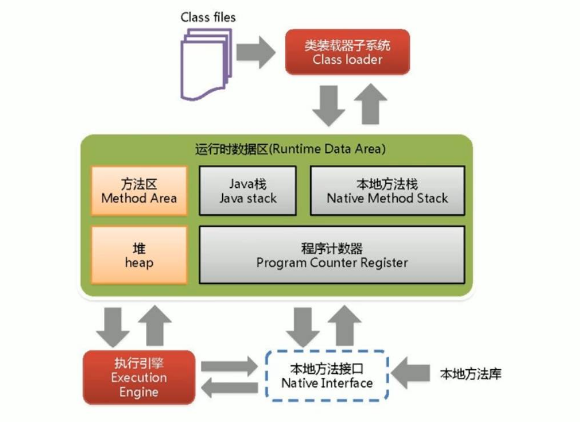
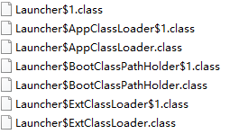
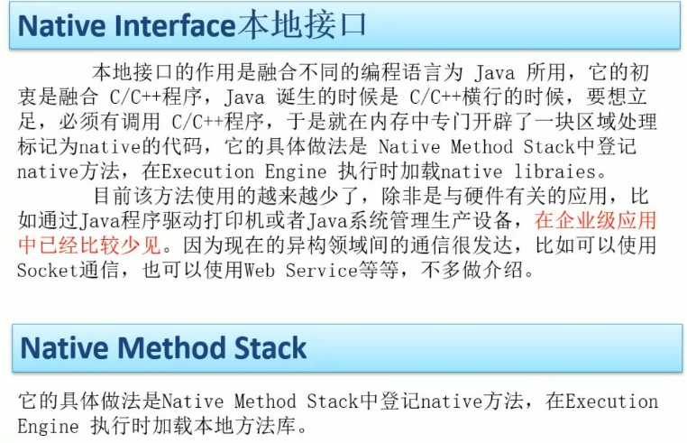

# juc

## 进程和线程

进程是资源（内存，CPU）分配的基本单位，线程是轻量化的进程，受 CPU 调度和分派的基本单位。一个程序运行就是一个进程，而一个进程往往有多个线程。多线程的程序可以提供丰富的功能。

## 并发和并行

并发指多个人同时做一件事，如秒杀活动。

并行指多个操作同时处理，如一个人同时做多件事

## 三个包

java.util.concurrent

java.util.concurrent.atomic

java.util.concurrent.locks

## WWH

what 什么是 juc？

why 为什么要用 juc？

how 怎么用 juc？


# jvm

## 问题

请谈谈你对 JVM 的理解？java8 的虚拟机有什么更新？

什么是 00M ？什么是 StackOverflowError？有哪些方法分析？

JVM 的常用参数调优你知道哪些？

谈谈 JVM 中，对类加载器你的认识？



## 类加载器

### 类加载器是什么

- java 文件编译成字节码文件，需要由类加载器子系统加载到虚拟机中。
- 字节码文件有特殊的标识：`cafe`。
- 加载时将文件内容转换成方法区运行时的数据结构。

### 有几种类加载器

jvm 一共有三种加载器，可通过继承 ClassLoader 类自定义类加载器

- Bootstrap ClassLoader，rt 包 jre1.8.0_221/lib/rt.jar
- Extension ClassLoader，扩展包
- Application ClassLoader，定义类
- 还可以继承 ClassLoader 类，自定义加载器，级别为 AppClassLoader 之下

通过查看源码 `rt.jar\sun\misc` 可以看到加载器的存储位置在 rt(run time) 包下，即运行时就会加载的包。



### 双亲委派机制 Parents Delegate

类加载的时候不同的加载器来加载类，都会先往上传递，交给 Bootstrap 类加载器，它不能加载的类再交给 Extension 类加载器， Extension 类加载器不能加载再交给 AppClassLoader 类加载器，如果还不能加载类，则会报 ClassNotFoundException。因此，由不同的类加载器加载 Object 类，最终加载的都是同一个。

```java
package jvm;

public class ClassLoaderTest01 {
    public static void main(String[] args) {
        ClassLoaderTest01 c = new ClassLoaderTest01();
        System.out.println(c.getClass().getClassLoader());
        System.out.println(c.getClass().getClassLoader().getParent());
        System.out.println(c.getClass().getClassLoader().getParent().getParent());

        Object o = new Object();
        System.out.println(o.getClass().getClassLoader());
        System.out.println(o.getClass().getClassLoader().getParent());

        /*
        output:
        sun.misc.Launcher$AppClassLoader@18b4aac2
        sun.misc.Launcher$ExtClassLoader@1b6d3586
        null
        null
        Exception in thread "main" java.lang.NullPointerException
            at jvm.ClassLoaderTest01.main(ClassLoaderTest01.java:12)

        Process finished with exit code 1
         */
    }
}
```

从输出结果可以看到，自定义的类由 AppClassLoader 加载，AppClassLoader 父类为 ExtClassLoader，ExtClassLoader 父类为 Bootstrap ClassLoader，打印结果为 null，再**往上找**就出现了 NullPointerException。

### 沙箱安全

由于类加载有双亲委派机制，以下代码虽然在语法上没有问题，编译可以通过，但是运行的时候由于加载的是 java.lang 包下的 String 类，AppClassLoader 会往上查找，最终由 Bootstrap ClassLoader 加载。

因此双亲委派机制能够保证 java 运行环境是安全无污染的。

```java
package java.lang;

publicclassString{
    publicstaticvoidmain(String[]args){
        fun1();
    }

    publicstaticvoidfun1(){
        System.out.println("String.fun1");
    }
}
      
错误: 在类 java.lang.String 中找不到 main 方法, 请将 main 方法定义为:
	public static void main(String[] args)
否则 JavaFX 应用程序类必须扩展javafx.application.Application
```

## 执行引擎 Execution Engine

执行引擎的作用是：解释命令，和操作系统交互

## 本地方法接口和本地方法栈

和底层交互的栈区，一些以 native 关键字修饰的方法使用的栈区，程序计数器对这里的指令为 null，以 C 语言写的方法放置的区域。



## 寄存器

线程**私有**，指针，作用是指向方法区的方法字节码，所占内存小，可忽略不计，几乎不存在 gc。


## 方法区

存储的是类结构信息，例如字节码文件 Car.class 通过类加载器加载到 JVM 内存中，成为一个模板文件 Car Class，以后实例化一个个对象都是从这个模板文件开始的。

方法区有运行时常量池，类的属性、方法数据，构造方法和普通方法信息。

不同 JDK 版本的方法区有所区别，这个跟实现有关，JDK 7 为永久代 (PermGen Space) ，JDK 8 为元空间 (Metaspace)。

实例变量不是存放在方法区中，而是存放在堆内存中。

## 栈

栈管运行，堆管存储。


## gc

四大垃圾收集算法

七个垃圾收集器

# juc 核心知识

## JMM

Java Memory Module，Java 内存模型，是一种规范。

## volatile 关键字

[详细代码](../juc/src/volatiledemo)

### 保证变量的可见性

```java
/**
 * volatile 保证了变量在多线程运行下的可见性
 */
public class VolatileDemo {
    public static void main(String[] args) {
        seeOkByVolatile();
    }
    
    public static void seeOkByVolatile() {
        MyData myData = new MyData();
        new Thread(() -> {
            try {
                TimeUnit.SECONDS.sleep(3);
            } catch (InterruptedException e) {
                e.printStackTrace();
            }
            System.out.println(Thread.currentThread().getName() + "\t in ThreadA");
            myData.addTo60();
            System.out.println(Thread.currentThread().getName() + "\t number change to 60 \t" + myData.number);
        }, "ThreadA").start();

        while (myData.number == 0) {

        }

        System.out.println(Thread.currentThread().getName() + "\t number != 0");
    }
}

class MyData {
    //int number = 0;
    volatile int number = 0;

    public void addTo60() {
        this.number = 60;
    }
}
```

未加 volatile 关键字，变量处于线程不可见的状态，陷入循环：

```java
ThreadA	 in ThreadA
ThreadA	 number change to 60 	60
······
```

加入 volatile 关键字，变量的值在 ThreadA 和 main 线程间贡献，跳出循环：

```java
ThreadA	 in ThreadA
ThreadA	 number change to 60 	60
main	 number != 0
```

### 不保证操作的原子性

原子性：不可分割，完整性，即某个线程正在做某个动作，中间不可以被加塞或者被分割，需要整体完整；要么同时成功，要么同时失败。

多个线程同时对一个变量进行操作，不保证变量的原子性：MyData 增加 addPlusPlus() 操作，

```java
class MyData {
    public void addPlusPlus() {
        this.number++;
    }
}
```

在测试类中：

```java
/* 
 * volatile 不保证原子性
 */
public class VolatileDemo {
    public static void main(String[] args) {
        atomicNotOkByVolatile();
    }

    public static void atomicNotOkByVolatile() {
        MyData myData = new MyData();
        for (int i = 0; i < 30; i++) {
            new Thread(() -> {
                for (int j = 0; j < 1000; j++) {
                    myData.addPlusPlus();
                }
            }, String.valueOf(i)).start();
        }

        //两个线程：一个 main 线程，一个 gc 线程
        while (Thread.activeCount() > 2) {
            Thread.yield();
        }

        System.out.println(Thread.currentThread().getName() + "\t" + myData.number);
    }
}
```

输出的结果极少会等于 30,000。

在方法上添加 synchronize 关键字就可以保证了：

```java
class MyData {
    public synchronize void addPlusPlus() {
        this.number++;
    }
}
```

### 注 —— 问题产生

学习到这里产生两个问题：++ 自增操作具体由哪几步构成；synchronize 锁住的区域太大，能否有轻量级的锁法？

解答一问：++ 操作是怎么完成的

编写一个简单的测试用例：

```java
public class IncrementTest {

    int i = 0;

    public void addPlusPlus() {
        i++;
    }
}
```

通过 `javap -c volatiledemo.IncrementTest` 反编译命令得到其 class 文件：

```java
Compiled from "IncrementTest.java"
public class volatiledemo.IncrementTest {
  int i;

  public volatiledemo.IncrementTest();
    Code:
       0: aload_0
       1: invokespecial #1                  // Method java/lang/Object."<init>":()V
       4: aload_0
       5: iconst_0
       6: putfield      #2                  // Field i:I
       9: return

  public void addPlusPlus();
    Code:
       0: aload_0
       1: dup
       2: getfield      #2                  // Field i:I
       5: iconst_1
       6: iadd
       7: putfield      #2                  // Field i:I
      10: return
}
```

可以看到 ++ 分为三个指令，先从主内存获取变量的值，在工作内存中 + 1，再写到主内存中；由于是多线程的读和写入，会出现写覆盖的情况，导致最终出现丢失写值的结果。

```java
       2: getfield      #2                  // Field i:I
       5: iconst_1
       6: iadd
       7: putfield      #2                  // Field i:I
```


