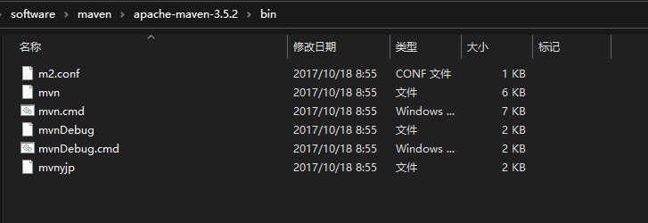

# Maven 的学习总结

## 什么是 Maven

Maven：Apache 的一款开源**自动化**的**项目管理**工具，主要有两项功能：

- 项目构建：主要是项目的清理，编译，测试，打包，部署等工作 
- 依赖管理：pom.xml，通过 pom 文件上的坐标自动下载jar包

## 现有的问题

随着 JavaWeb 项目的变大，引入的第三方依赖越来越多，产生的问题有：

- 频繁引入相同的 jar 包
- jar 包间存在相互依赖的问题，有时为了引入一个 jar 包还需要下其依赖的 jar 包
- jar 包获取存在问题，不同的 jar 包在其官网的获取方式有所不同
- 随着项目的拆分成多个模块 module，每个模块都需要进行构建，这些相同的步骤如果由人工完成繁琐而耗费精力

由于上述问题的产生，才需要一些工具来管理项目。

## Maven 原理

基于上述问题，由 Maven 平台去各个提供 jar 包的公司下载，然后存放其远程仓库中，当我们需要的时候，跟 Maven 打交道即可。Maven 就像一个商店，我们购物，而不关心物品如何从厂家运送到商店。

Maven 也一并处理了 jar 包的依赖关系问题，在下载 jar 包的时候，Maven 会帮忙下载其依赖的 jar 包，这就解决了 jar 包的依赖问题。

在下载 jar 包到本地的时候，也建立起本地的仓库，日后还要使用 jar 包，Maven 会先在本地仓库查找，找到就使用，找不到就到远程仓库查找。这就解决了频繁 引入相同的 jar 包问题。

接下来就引入一个问题：Maven 是如何确定 jar 包的？

答案是当创建一个 Maven 项目时，会产生一个 pom.xml 文件，文件中的依赖坐标会定位一个 jar 包。三个参数分别是，组织的 id，一般是组织官网域名倒着写，跟 Java 开发时包命名相似；jar 包的名称；jar 包的版本。

```xml
<!-- https://mvnrepository.com/artifact/org.springframework/spring-context -->
<dependency>
    <groupId>org.springframework</groupId>
    <artifactId>spring-context</artifactId>
    <version>5.1.5.RELEASE</version>
</dependency>
```

Maven 中还集成了一些项目构建命令，运行 Maven 命令其实就是在调用已经写好的项目构建命令，达到自动化构建项目的目的。




这些 Maven 的命令都是一些脚本命令，可以自动化构建项目。

## Maven 的下载

安装包可以在[官网](https://maven.apache.org/)或者 [GitHub 地址](https://github.com/apache/maven) 下载。安装配置可参照 https://www.cnblogs.com/eagle6688/p/7838224.html，根据本人的使用，有以下几点说明：

Maven 的环境变量配置作用和 Java 的相似，为的是在 DOS 命令下能够在任何目录下使用。

Maven 的本地仓库配置主要有三点：

[~\apache-maven-3.5.2\conf\settings.xml](#完整的 Maven 配置文件)

一、修改本地仓库的地址，默认是 C 盘下，为了避免占用 C 盘的空间，建议换个目录存放。

```xml
<localRepository>F:\software\maven\repository</localRepository>
```

二、修改下载 jar 包的地址，Maven 原来的远程仓库是在国外，访问较慢，使用阿里云镜像可以加快下载速度。

```xml
<mirror>
    <id>nexus-aliyun</id>
    <mirrorOf>central</mirrorOf>
    <name>Nexus aliyun</name>
    <url>http://maven.aliyun.com/nexus/content/groups/public</url>
</mirror>
```

三、修改编译的 JDK 版本为 JDK 1.8。

```xml
<profile>    
    <id>jdk-1.8</id>    
    <activation>    
        <activeByDefault>true</activeByDefault>    
        <jdk>1.8</jdk>    
    </activation>    
    <properties>    
        <maven.compiler.source>1.8</maven.compiler.source>    
        <maven.compiler.target>1.8</maven.compiler.target>
        <maven.compiler.compilerVersion>1.8</maven.compiler.compilerVersion> 
    </properties>    
</profile>
```

Maven 的 README 文档提示，Maven 是用  Java 语言写的，需要运行在 JRE 上，版本要求 1.7 以上，内存要求有两个，一个是软件安装要求 10 M，另一个是仓库存储要求，500 M +。

```
  System Requirements
  -------------------

  JDK:
    1.7 or above (this is to execute Maven - it still allows you to build against 1.3
    and prior JDK's).
    System Requirements
  -------------------

  JDK:
    1.7 or above (this is to execute Maven - it still allows you to build against 1.3
    and prior JDK's).
```


## Maven 的远程仓库

上面解释原理的部分引入了 jar 包，以下提供 jar 包的查找地址：https://mvnrepository.com/

通过这个网站可以查找 Maven 引入 jar 包的 pom.xml 文件坐标。

至此，Maven 的原理以及一些注意点介绍完毕，日后有更深的感悟将完善此文，以下是本地完整的 Maven 配置文件。

## 完整的 Maven 配置文件

```xml
<?xml version="1.0" encoding="UTF-8"?>

<!--
Licensed to the Apache Software Foundation (ASF) under one
or more contributor license agreements.  See the NOTICE file
distributed with this work for additional information
regarding copyright ownership.  The ASF licenses this file
to you under the Apache License, Version 2.0 (the
"License"); you may not use this file except in compliance
with the License.  You may obtain a copy of the License at

    http://www.apache.org/licenses/LICENSE-2.0

Unless required by applicable law or agreed to in writing,
software distributed under the License is distributed on an
"AS IS" BASIS, WITHOUT WARRANTIES OR CONDITIONS OF ANY
KIND, either express or implied.  See the License for the
specific language governing permissions and limitations
under the License.
-->

<!--
 | This is the configuration file for Maven. It can be specified at two levels:
 |
 |  1. User Level. This settings.xml file provides configuration for a single user,
 |                 and is normally provided in ${user.home}/.m2/settings.xml.
 |
 |                 NOTE: This location can be overridden with the CLI option:
 |
 |                 -s /path/to/user/settings.xml
 |
 |  2. Global Level. This settings.xml file provides configuration for all Maven
 |                 users on a machine (assuming they're all using the same Maven
 |                 installation). It's normally provided in
 |                 ${maven.conf}/settings.xml.
 |
 |                 NOTE: This location can be overridden with the CLI option:
 |
 |                 -gs /path/to/global/settings.xml
 |
 | The sections in this sample file are intended to give you a running start at
 | getting the most out of your Maven installation. Where appropriate, the default
 | values (values used when the setting is not specified) are provided.
 |
 |-->
<settings xmlns="http://maven.apache.org/SETTINGS/1.0.0"
          xmlns:xsi="http://www.w3.org/2001/XMLSchema-instance"
          xsi:schemaLocation="http://maven.apache.org/SETTINGS/1.0.0 http://maven.apache.org/xsd/settings-1.0.0.xsd">
  <!-- localRepository
   | The path to the local repository maven will use to store artifacts.
   |
   | Default: ${user.home}/.m2/repository
  <localRepository>/path/to/local/repo</localRepository>
  -->
  <localRepository>F:\software\maven\repository</localRepository>

  <!-- interactiveMode
   | This will determine whether maven prompts you when it needs input. If set to false,
   | maven will use a sensible default value, perhaps based on some other setting, for
   | the parameter in question.
   |
   | Default: true
  <interactiveMode>true</interactiveMode>
  -->

  <!-- offline
   | Determines whether maven should attempt to connect to the network when executing a build.
   | This will have an effect on artifact downloads, artifact deployment, and others.
   |
   | Default: false
  <offline>false</offline>
  -->

  <!-- pluginGroups
   | This is a list of additional group identifiers that will be searched when resolving plugins by their prefix, i.e.
   | when invoking a command line like "mvn prefix:goal". Maven will automatically add the group identifiers
   | "org.apache.maven.plugins" and "org.codehaus.mojo" if these are not already contained in the list.
   |-->
  <pluginGroups>
    <!-- pluginGroup
     | Specifies a further group identifier to use for plugin lookup.
    <pluginGroup>com.your.plugins</pluginGroup>
    -->
  </pluginGroups>

  <!-- proxies
   | This is a list of proxies which can be used on this machine to connect to the network.
   | Unless otherwise specified (by system property or command-line switch), the first proxy
   | specification in this list marked as active will be used.
   |-->
  <proxies>
    <!-- proxy
     | Specification for one proxy, to be used in connecting to the network.
     |
    <proxy>
      <id>optional</id>
      <active>true</active>
      <protocol>http</protocol>
      <username>proxyuser</username>
      <password>proxypass</password>
      <host>proxy.host.net</host>
      <port>80</port>
      <nonProxyHosts>local.net|some.host.com</nonProxyHosts>
    </proxy>
    -->
  </proxies>

  <!-- servers
   | This is a list of authentication profiles, keyed by the server-id used within the system.
   | Authentication profiles can be used whenever maven must make a connection to a remote server.
   |-->
  <servers>
    <!-- server
     | Specifies the authentication information to use when connecting to a particular server, identified by
     | a unique name within the system (referred to by the 'id' attribute below).
     |
     | NOTE: You should either specify username/password OR privateKey/passphrase, since these pairings are
     |       used together.
     |
    <server>
      <id>deploymentRepo</id>
      <username>repouser</username>
      <password>repopwd</password>
    </server>
    -->

    <!-- Another sample, using keys to authenticate.
    <server>
      <id>siteServer</id>
      <privateKey>/path/to/private/key</privateKey>
      <passphrase>optional; leave empty if not used.</passphrase>
    </server>
    -->
  </servers>

  <!-- mirrors
   | This is a list of mirrors to be used in downloading artifacts from remote repositories.
   |
   | It works like this: a POM may declare a repository to use in resolving certain artifacts.
   | However, this repository may have problems with heavy traffic at times, so people have mirrored
   | it to several places.
   |
   | That repository definition will have a unique id, so we can create a mirror reference for that
   | repository, to be used as an alternate download site. The mirror site will be the preferred
   | server for that repository.
   |-->
  <mirrors>
    <!-- mirror
     | Specifies a repository mirror site to use instead of a given repository. The repository that
     | this mirror serves has an ID that matches the mirrorOf element of this mirror. IDs are used
     | for inheritance and direct lookup purposes, and must be unique across the set of mirrors.
     |
    <mirror>
      <id>mirrorId</id>
      <mirrorOf>repositoryId</mirrorOf>
      <name>Human Readable Name for this Mirror.</name>
      <url>http://my.repository.com/repo/path</url>
    </mirror>
    
	<mirror>  
      <id>alimaven</id>  
      <name>aliyun maven</name>  
      <url>http://maven.aliyun.com/nexus/content/repositories/central</url>  
      <mirrorOf>central</mirrorOf>          
    </mirror>
	-->
	<mirror>
	  <id>nexus-aliyun</id>
	  <mirrorOf>central</mirrorOf>
	  <name>Nexus aliyun</name>
	  <url>http://maven.aliyun.com/nexus/content/groups/public</url>
	</mirror>
  </mirrors>

  <!-- profiles
   | This is a list of profiles which can be activated in a variety of ways, and which can modify
   | the build process. Profiles provided in the settings.xml are intended to provide local machine-
   | specific paths and repository locations which allow the build to work in the local environment.
   |
   | For example, if you have an integration testing plugin - like cactus - that needs to know where
   | your Tomcat instance is installed, you can provide a variable here such that the variable is
   | dereferenced during the build process to configure the cactus plugin.
   |
   | As noted above, profiles can be activated in a variety of ways. One way - the activeProfiles
   | section of this document (settings.xml) - will be discussed later. Another way essentially
   | relies on the detection of a system property, either matching a particular value for the property,
   | or merely testing its existence. Profiles can also be activated by JDK version prefix, where a
   | value of '1.4' might activate a profile when the build is executed on a JDK version of '1.4.2_07'.
   | Finally, the list of active profiles can be specified directly from the command line.
   |
   | NOTE: For profiles defined in the settings.xml, you are restricted to specifying only artifact
   |       repositories, plugin repositories, and free-form properties to be used as configuration
   |       variables for plugins in the POM.
   |
   |-->
  <profiles>
    <!-- profile
     | Specifies a set of introductions to the build process, to be activated using one or more of the
     | mechanisms described above. For inheritance purposes, and to activate profiles via <activatedProfiles/>
     | or the command line, profiles have to have an ID that is unique.
     |
     | An encouraged best practice for profile identification is to use a consistent naming convention
     | for profiles, such as 'env-dev', 'env-test', 'env-production', 'user-jdcasey', 'user-brett', etc.
     | This will make it more intuitive to understand what the set of introduced profiles is attempting
     | to accomplish, particularly when you only have a list of profile id's for debug.
     |
     | This profile example uses the JDK version to trigger activation, and provides a JDK-specific repo.
    <profile>
      <id>jdk-1.4</id>

      <activation>
        <jdk>1.4</jdk>
      </activation>

      <repositories>
        <repository>
          <id>jdk14</id>
          <name>Repository for JDK 1.4 builds</name>
          <url>http://www.myhost.com/maven/jdk14</url>
          <layout>default</layout>
          <snapshotPolicy>always</snapshotPolicy>
        </repository>
      </repositories>
    </profile>
    -->
	
	<profile>    
		<id>jdk-1.8</id>    
	   	    <activation>    
				<activeByDefault>true</activeByDefault>    
				<jdk>1.8</jdk>    
		    </activation>    
		<properties>    
			<maven.compiler.source>1.8</maven.compiler.source>    
			<maven.compiler.target>1.8</maven.compiler.target>
			<maven.compiler.compilerVersion>1.8</maven.compiler.compilerVersion> 
		</properties>    
	</profile>

    <!--
     | Here is another profile, activated by the system property 'target-env' with a value of 'dev',
     | which provides a specific path to the Tomcat instance. To use this, your plugin configuration
     | might hypothetically look like:
     |
     | ...
     | <plugin>
     |   <groupId>org.myco.myplugins</groupId>
     |   <artifactId>myplugin</artifactId>
     |
     |   <configuration>
     |     <tomcatLocation>${tomcatPath}</tomcatLocation>
     |   </configuration>
     | </plugin>
     | ...
     |
     | NOTE: If you just wanted to inject this configuration whenever someone set 'target-env' to
     |       anything, you could just leave off the <value/> inside the activation-property.
     |
    <profile>
      <id>env-dev</id>

      <activation>
        <property>
          <name>target-env</name>
          <value>dev</value>
        </property>
      </activation>

      <properties>
        <tomcatPath>/path/to/tomcat/instance</tomcatPath>
      </properties>
    </profile>
    -->
  </profiles>

  <!-- activeProfiles
   | List of profiles that are active for all builds.
   |
  <activeProfiles>
    <activeProfile>alwaysActiveProfile</activeProfile>
    <activeProfile>anotherAlwaysActiveProfile</activeProfile>
  </activeProfiles>
  -->
</settings>
```


## Maven 的依赖

compile test provided 是三个常用的 scope 标签，其表示依赖作用的过程：

- compile，作用在编译和运行时
- test，作用在测试时
- provided，在打包的时候不会添加进依赖包，如 servlet-api，因为在 Tomcat 或其他容器中内置了 servlet-api，因此只在编码的时候方便测试

此外还有 import 作用域，因为 maven 的项目也是支持单继承的，当需要使用 SpringBoot 的 starter，但是又不想要继承它时，就可以在单独的 pom 文件中使用 dependencymanagement 中定义。在子工程时就可以导入依赖。


